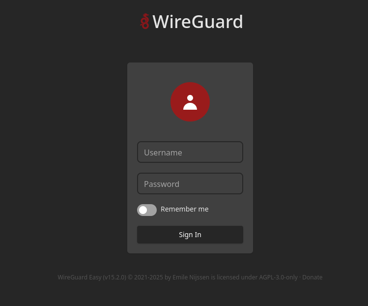
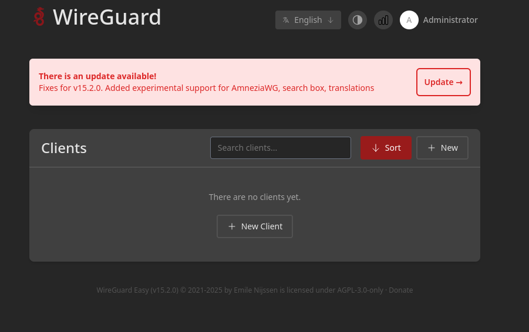
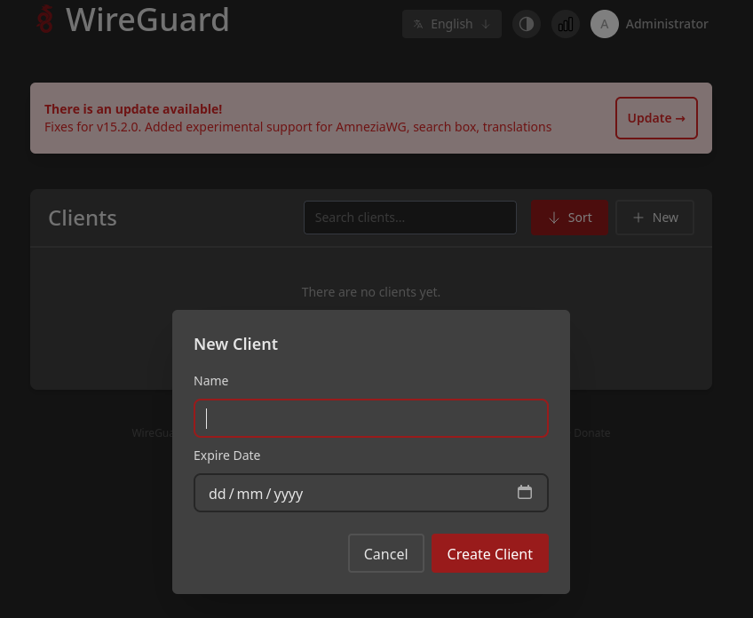
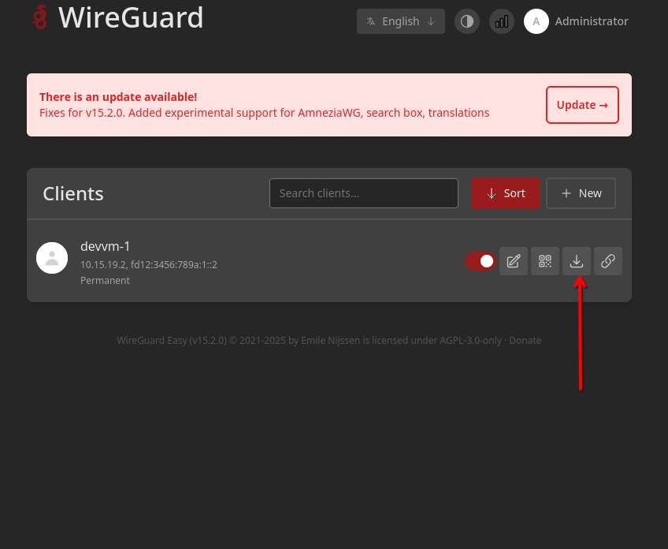
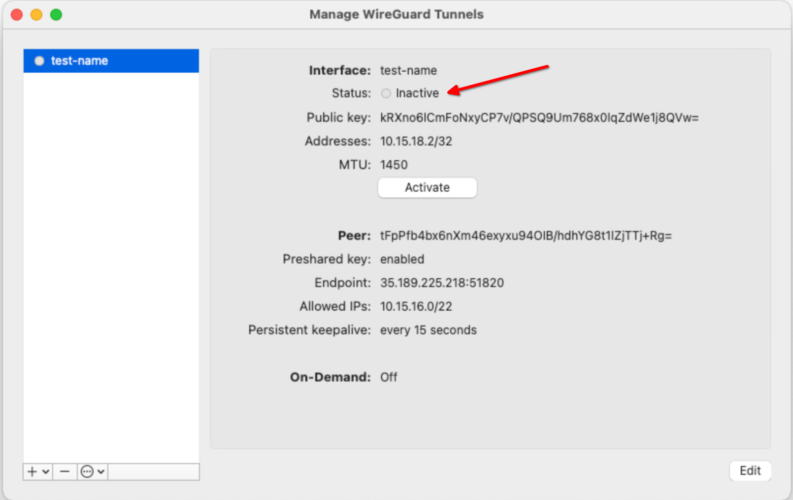

# Devvm - development VM

This directory contains the code used to set up virtual machines with fully configured container registry and GitLab both as Omnibus and Charts-based installs.
The intention is to provide developers with a working system that they can use for development and experimentation, as well as a way for them to share their work with others for collaboration and/or review.

[[_TOC_]]

## Terminology

Across this document, we use the following terms:

- `devvm`: to refer to the virtual machine running GitLab together with container registry.
- Booter: the program that runs on the `devvm` during its first start. It sets up all dependencies like Postgres, MinIO, Valkey, etc.. as well as configures and installs GitLab. It is started automatically by systemd while the machine starts.

## Quickstart

This quickstart outlines the steps needed to set up a fully working development environment.

In the [Architecture](#architecture) section you can find more details about implementation details.
In the [Roadmap](#roadmap) section you can find the current roadmap for devvm development.

### Prerequisites

To successfully deploy `devvm`, you must have:

- A GCE account capable to create and delete virtual machines in the container registry's `dev-package-container-96a3ff34` project.
- The `Wireguard` VPN installed. See [Wireguard install instructions](https://www.wireguard.com/install/).

Wireguard is used to access Devvms once they are provisioned.
It provides full L3 connectivity, which gives much more freedom to expermient and iterate than forwarding only a set of ports. 

### Use `devvm` CLI tool

The `devvm` CLI binary is a tool that automates operations on devvms.
It is written in Go and requires to be compiled after the first check out of the repository and after every update.
This can be done by executing the following steps in the [devvm](https://gitlab.com/gitlab-org/container-registry.git) repository checkout:

```shell
cd devvm/go/
go build -o devvm ./cmd/devvm/main.go
```

Run the CLI tool without any arguments to print the help doc:

```shell
devvm is a tool to manage devvms

Usage:
  devvm [command]

Available Commands:
  completion  Generate the autocompletion script for the specified shell
  create      Launch a devvm
  delete      Delete a devvm
  help        Help about any command
  kubeconfig  Fetch kubeconfig from a running devvm
  list        List devvms

Flags:
  -h, --help               help for devvm
      --log-level string   logging subsystem log level (default "info")

Use "devvm [command] --help" for more information about a command.
```

See the help of individual subcommands for information about the available options and their defaults.

The CLI uses Application Default Credentials in order to perform GCE API calls, please make sure that you have set them up correctly ([documentation](https://cloud.google.com/docs/authentication/provide-credentials-adc)).

### Creating a `devvm` VM

> Depending on the zone you are deploying Devvm to, the VM will cost around 170$-200$ per month.
> Personal sandboxes have a safeguard that VM will be shut down after 7 days in order to keep the costs at bay.

`devvm` requires you to provide an SSH key in order to be able to access your devvm.
In order to create an SSH key suitable for devvm, try executing:

```shell
ssh-keygen -t ecdsa -f devvm_key.ssh_key
```

You also need to log-into GCloud that you use to launch devvms:

```plaintext
gcloud auth login

```

It is recommended, but not required, to set up a passphrase for the key.
`devvm` cli supports `ssh-agent`.
Please note down the path to the private key generated above, we will use it in the later steps throughout the document.

Launching devvm itself can be done with a single CLI `create` call.
Usually, you will simply use:

```shell
$ ./devvm create  <devvm-name> -z <GCE zone> -k <ssh-key path> -l <ee license path>  --ee 
2026-01-26T13:54:07+01:00       info    SSH key ready from /home/vespian/.ssh/devvm_key
will not retry non-retryable GCE API error googleapi: Error 404: The resource 'projects/dev-package-container-96a3ff34/zones/europe-west10-b/instances/devvm-pr-charts-4' was not found, err_reason: notFound, total_retries: 1, max_retries: 5
2026-01-26T13:54:30+01:00       info    Instance ensured        {"created": true}
2026-01-26T13:54:30+01:00       info    Devvm public IP: 1.2.3.4
2026-01-26T13:54:58+01:00       info    Uploading license file from /home/vespian/.gitlab_ee_license
2026-01-26T13:54:58+01:00       info    License file uploaded successfully
2026-01-26T13:55:04+01:00       info    Booter is executing:
2026-01-26T13:55:04+01:00       info     - stage: Ensure Kind cluster is running, status: inProgress, run duration: 0s, retries count: 0
2026-01-26T13:55:04+01:00       info     - stage: PostgreSQL Databases, status: inProgress, run duration: 0s, retries count: 0
2026-01-26T13:55:04+01:00       info     - stage: MinIO Object Storage, status: inProgress, run duration: 0s, retries count: 0
2026-01-26T13:55:09+01:00       info    Booter is executing:
2026-01-26T13:55:09+01:00       info     - stage: Ensure Kind cluster is running, status: inProgress, run duration: 0s, retries count: 0
2026-01-26T13:55:49+01:00       info    Booter is executing:
2026-01-26T13:55:49+01:00       info     - stage: Ensure auxiliary k8s manifests are deployed, status: inProgress, run duration: 0s, retries count: 0
2026-01-26T13:57:19+01:00       info    Booter is executing:
2026-01-26T13:57:19+01:00       info     - stage: Deploy GitLab Helm chart, status: inProgress, run duration: 0s, retries count: 0
2026-01-26T14:03:12+01:00       info    Booter finished initialization of the devvm
2026-01-26T14:03:12+01:00       info    All done!
```

The `Error 404:` message can be safely ignored.

It can take around 10 minutes to launch a Devvm.
The majority of time is spent installing GitLab with database migrations, both for Container Registry and GitLab Rails itself, being main contributors.
Users can opt out of installing GitLab via `--no-deploy` flag.
In this case provisioning all the services and pre-configuring Chart/Omnibus takes <1 minute but the user needs to install GitLab themselves. 
Booter will print in such case instructions how to do it.
This approach can also be used to fine-tune GitLab configuration before deploying it.

The CLI provides a built-in help for every command:

```shell
$ ./devvm create --help
Launch a new devvm instance.

If an SSH key is provided with --ssh-key-path, the command will:
1. First try to parse the key without a passphrase (for unencrypted keys)
2. If the key is encrypted, check if it's available in the SSH agent
3. If not found in the SSH agent, prompt for the passphrase

This means if your key is already loaded in an SSH agent, you won't need to enter
the passphrase manually.

Usage:
  devvm create <devvm-name> [flags]

Aliases:
  create, launch, start

Flags:
      --ee                       enable GitLab EE version (requires --license)
  -g, --gitlab-branch string     GitLab branch to use to launch VM (default "master")
  -h, --help                     help for create
  -i, --image-name string        devvm base image to use for launching the VM (default "devvm-current")
  -l, --license string           path to GitLab EE license file to upload to the devvm
      --no-deploy                skip GitLab deployment
      --omnibus                  use omnibus deployment instead of charts (default: charts)
  -r, --registry-branch string   GOB branch to use to launch VM (default "main")
  -k, --ssh-key-path string      SSH key to use to launch devvm (uses SSH agent if key is encrypted and agent is available)
  -z, --zone string              GCE zone to launch VM in (default "europe-west1-b")

Global Flags:
      --log-level string   logging subsystem log level (default "info")
```

The `devvm` cli will print which setup stages are currently executed.
Stages are executed in pararell to speed things up.

In case you break devvm or want to reset its state, the easiest way is to simply create a new `devvm` and destroy the old one.

You should launch `devvm` in the zone close to your location for minimal latency.
By default, we launch it in Europe/Belgium (`europe-west1-b`).
For the list of all GCE zones, see [GCE documentation](https://cloud.google.com/compute/docs/regions-zones#available).

For the rest of this tutorial, we assume that we launched a `devvm` named `devvm-1` in the default zone `europe-west1-b`.

### Log into the `devvm`

In order to log into the devvm, you need its public IP.
You can find it in the output of the `create` subcommand, or using the `list` CLI:

```shell
$ ./devvm list
europe-west10-b - devvm-pr-charts-1 RUNNING 1.2.3.4 6h3m46.257290376s
europe-west10-b - devvm-pr-charts-2 RUNNING 1.2.3.5 1h14m42.763317189s
europe-west10-b - devvm-pr-charts-4 RUNNING 1.2.3.6 5m55.538324108s
europe-west10-b - devvm-pr-omnibus-1 RUNNING 1.2.3.7 1h49m3.611329892s
```

Now you can log into the devvm, using either your SSH key or GCE `gcloud` command.
In case of an SSH key, log-in as `dev` user:

```shell
$ ssh dev@1.2.3.4
Welcome to ...!

Please make sure to add these entries to your /etc/hosts file

10.15.17.1 svc.devvm 
10.15.18.1 registry.gitlab.devvm gitlab.devvm

In order to determine if machine is healthy, please execute:

sudo -u dev /home/dev/devvm/devvm/go/booter -watch

Happy hacking!
```

Follow the instructions in the command output and add the required entries to your _local_ `/etc/hosts` file (not in the devvm filesystem).
We will need them later on.

### Start monitoring the progress of booter

> The `devvm` credentials used here were already deleted before publishing this text.

As mentioned in the welcome message after you logged in, you can monitor the setup of the `devvm`.

```shell
dev@devvm-1:~$ /home/dev/devvm/go/booter
```

The booter will continuously update the status as the setup process progresses.
At the end of the process, you should see something like this:

```plaintext
    |dev@devvm-pr-charts-4:~$ ./devvm/devvm/go/booter
    |Booter status:
    |Reading Network addresation information:       [OK]
    |        SVC IP: 10.15.17.1
    |        K8s VIP range start: 10.15.18.1
    |        K8s VIP range end: 10.15.18.32
    |        Stage retries count: 0
    |        Stage total time: 4.32654ms
    |Reading VM metadata labels:                    [OK]
    |        Deployment type: charts
    |        EE version: true
    |        No deploy: false
    |        Stage retries count: 0
    |        Stage total time: 10.61395ms
    |TLS Certificates Generation:                   [OK]
    |        TLS certificates generated in /etc/gitlab/ssl
    |        Certificate for domains [gitlab.devvm registry.gitlab.devvm 10.15.17.1] have been created
    |        Certificate key: /etc/gitlab/ssl/gitlab.devvm+2-key.pem
    |        Certificate PEM: /etc/gitlab/ssl/gitlab.devvm+2.pem
    |        CA certificate: /etc/ssl/certs/mkcert_development_CA_284710067254941405059883834170770632780.pem
    |        Stage retries count: 0
    |        Stage total time: 1.974038704s
(5) |Ensure Kind cluster is running:                [OK]
    |        kubectl is available at /home/dev/kubeconfig
    |        try copying it to your home dir and using:
    |                gcloud compute scp --zone <devvm-zone> <devvm-name>:~/kubeconfig ~/kubeconfig
    |        Stage retries count: 0
    |        Stage total time: 48.79222721s
    |PostgreSQL Databases:                          [OK]
    |        PostgreSQL has been configured
    |          Registry database:
    |            database: registry_db
    |            username: registry_user
    |            password: ptVkm9t463y9TI49Tn4mZ2uvjWxJZTi9
    |          GitLab database:
    |            database: gitlab_db
    |            username: gitlab_user
    |            password: APV6ZfLvKbjuZp7NUI7x53hXTS264R26
    |          CI database:
    |            database: ci_db
    |            username: ci_user
    |            password: YxTt5oVQ4y7K48ur33KcdADu0uQOnB72
    |        Stage retries count: 0
    |        Stage total time: 5.572100121s
    |MinIO Object Storage:                          [OK]
    |        MinIO has been configured
    |          root user: infallible_nash
    |          root password: 3sYql6O0jzOa31AlzlZXup3P7A5vi5K3
    |        Registry bucket access:
    |          bucket: gitlab-registry
    |          access key ID: OH20KOGH8X7FUCOUQ2JK
    |          secret access key: 4NNSGejA5lE4E07HlOh1OZmN3jTF4omGQ0WlSGt8
    |          endpoint: 10.15.17.1:9000
    |        Backup buckets access:
    |          backup bucket: gitlab-backup
    |          backup tmp bucket: gitlab-backup-tmp
    |          access key ID: Y689HKHXD7QKTFILAP8S
    |          secret access key: oLbRJg16Y8SkgZA5mCfd2aNSFZpmj084f6Zu7aDK
    |          endpoint: 10.15.17.1:9000
    |        Unified buckets access:
    |          buckets: [gitlab-artifacts git-lfs gitlab-uploads gitlab-packages gitlab-mr-diffs gitlab-terraform-state gitlab-ci-secure-files gitlab-dependency-proxy gitlab-backups]
    |          access key ID: UZSKRLW8X0VJKX39HB8U
    |          secret access key: tCiYQjqEE7HbhH02BKsI5ad68ID7h9U4blxk6xWc
    |          endpoint: 10.15.17.1:9000
    |        Stage retries count: 0
    |        Stage total time: 9.720215707s
    |Valkey Cache:                                  [OK]
    |        Valkey has been configured
    |          GitLab database:
    |            database: 0
    |            username: gitlab_user
    |            password: VuA77EO1mphfXr0rMYMF6syeGN15P387
    |          Registry database:
    |            database: 1
    |            username: registry_user
    |            password: XTS4KwgcZW2K9Gn92PLn0E34NNYN48HM
    |        Stage retries count: 0
    |        Stage total time: 3.472938811s
(2) |Wireguard VPN:                                 [OK]
(3) |        ui is now reachable at: https://34.32.78.49:6000/
(1) |        username: youthful_ptolemy
    |        password: 84XJo6X1FE4dk4k8QCoAXRkJ1l8IpCw1
    |        Stage retries count: 0
    |        Stage total time: 2.473498099s
    |Ensure auxiliary k8s manifests are deployed:   [OK]
    |        Auxiliary manifests were deployed
    |        GitLab namespace 'gitlab' created
    |        GitLab admin password secret created
    |          admin password: SITFzkoc0nuo47YYpPYq001b2Pd4E81J
    |          admin username: root
    |        Pre-receive hook ConfigMap created
    |        PostgreSQL secrets created (gitlab-postgres-main, gitlab-postgres-ci, gitlab-postgres-registry)
    |        Valkey secrets created (gitlab-redis-main, gitlab-redis-registry)
    |        MinIO secrets created (gitlab-minio-registry, gitlab-minio-backup, gitlab-minio-unified)
    |        TLS secrets created (gitlab-gitlab-tls, gitlab-registry-tls)
    |        GitLab license secret created
    |        metrics-server installed via Helm
    |        GitLab Helm repository added and updated
    |        Stage retries count: 0
    |        Stage total time: 1m30.634698834s
    |Deploy GitLab Helm chart:                      [OK]
    |        GitLab Helm chart deployed successfully (Edition: EE)
    |        GitLab URL: https://gitlab.devvm
    |        Registry URL: https://registry.gitlab.devvm
    |        External IP: 10.15.18.1
    |        Stage retries count: 0
    |        Stage total time: 5m21.243572309s
    |
    |All tasks were successfully completed!
```

The column on the left with numbers in parentheses was added so we can refer to specific lines here.
In real output the numbers are not there.

Each paragraph is a separate stage that the booter progresses through.
In case of an error, a detailed error message is printed and the booter is restarted after few seconds.

You can also use the `-watch` flag to make the booter continuously print the status of the bootstrap process:

```shell
/home/dev/devvm/go/booter -watch
```

To terminate the program, press `Ctrl` + `C` or `Command` + `C`.

It is not necessary to wait for the booter to finish. You can execute steps below as soon as the booter marks the given stage as done (`[OK]`).

### Set up WireGuard tunneling

> At any given time there must be at most one active Devvm Wireguard connection active.
> Having more than one Wireguard connection active will lead to connectivity issues as Devvms have same addressing/routing configurations.

After the booter successfully completes the `WireGuard-UI services start` (2) stage, you can set up and download a WireGuard profile.
Enter the URL that is located on line (3) in your browser.
It is expected that certificate is not trusted, as `devvm` uses a self-signed one.

To create a WireGuard profile:

   1. Enter the username and password from line (1).

      

   1. Select **New client**.

      

   1. Enter a meaningful name for the new client.
      It is recommended to use the same name as the devvm for which we create Wireguard credentials.

      

   1. Select **Create client**.

   1. Download the WireGuard profile file for the newly created user.

      

   1. Import the profile on your workstation. These steps differ depending on your OS.

      - On an Ubuntu 22.04 LTS workstation running `NetworkManager`:

        ```shell
        nmcli connection import type wireguard file <path-to-downloaded-profile-file>
        ```

      - For MacOS:

        1. Follow the instructions in [Using WireGuard on macOS](https://mullvad.net/en/help/wireguard-macos-app/) but use the `WireGuard` app.
        1. Activate the profile once you imported it

           

   1. Confirm connectivity by pinging a remote IP from your workstation:

      ```shell
      $ ping -c3 svc.devvm

      PING gdk.devvm (10.15.17.1) 56(84) bytes of data.
      64 bytes from gdk.devvm (10.15.17.1): icmp_seq=1 ttl=64 time=28.4 ms
      64 bytes from gdk.devvm (10.15.17.1): icmp_seq=2 ttl=64 time=27.7 ms
      64 bytes from gdk.devvm (10.15.17.1): icmp_seq=3 ttl=64 time=27.8 ms

      --- gdk.devvm ping statistics ---
      3 packets transmitted, 3 received, 0% packet loss, time 2003ms
      rtt min/avg/max/mdev = 27.731/27.976/28.408/0.306 ms
      ```

### Set up Kubernetes configuration

After the booter successfully gets past the `Ensure Kind cluster is running` (5) state, you can download `kubeconfig` for the remote cluster:

1. Copy the `kubeconfig` onto your workstation:

   ```shell
   $ ./devvm kubeconfig devvm-pr-charts-4 --help
   Fetch the kubeconfig file from a running devvm instance.

   This command requires a custom SSH key that was used when creating the devvm.
   The kubeconfig can be printed to stdout or saved to a file.

   The --zone flag is optional if there is only one instance with the given name.
   If multiple instances with the same name exist in different zones, you must specify the zone.

   If an SSH agent is running and contains the key, the passphrase will not be required.

   Usage:
   devvm kubeconfig <devvm-name> [flags]

   Flags:
   -h, --help             help for kubeconfig
       --log-pretty       Enable pretty-formatting of logs
   -o, --output string    Output file path (if not specified, prints to stdout)
   -k, --ssh-key string   Path to the SSH private key used to create the devvm (required)
   -z, --zone string      GCE zone where the devvm is running (optional if only one instance with the name exists)

   Global Flags:
       --log-level string   logging subsystem log level (default "info")
   ```

   ```shell
   $ ./devvm kubeconfig devvm-pr-charts-2 --ssh-key ~/.ssh/devvm_key > ~/.kube/config
   {"lvl":"info","ts":1769438042.7767372,"msg":"SSH key ready from /home/vespian/.ssh/devvm_key"}
   {"lvl":"info","ts":1769438044.0690005,"msg":"Auto-detected zone: europe-west10-b"}
   {"lvl":"info","ts":1769438044.3608813,"msg":"Devvm public IP: 34.32.58.210"}
   ```

1. Make `kubectl` use the config file.
   You can either integreate it into your main kubeconfig file, or simply export KUBECONFIG variable:

   ```shell
   export KUBECONFIG=<destination dir on your workstation>/kubeconfig
   ```

1. Verify that you can reach the remote cluster:

   ```shell
   $ kubectl cluster-info

   Kubernetes control plane is running at https://10.15.16.4:6443
   CoreDNS is running at https://10.15.16.4:6443/api/v1/namespaces/kube-system/services/kube-dns:dns/proxy

   To further debug and diagnose cluster problems, use 'kubectl cluster-info dump'.
   ```

   ```shell
   $ kubectl get pods -n gitlab
   NAME                                             READY   STATUS             RESTARTS          AGE
   envoy-gateway-6dbb47656-rg24f                    0/1     CrashLoopBackOff   281 (3m56s ago)   17h
   gl-pr-gitaly-0                                   1/1     Running            0                 17h
   gl-pr-gitlab-shell-7bdb84b667-scfrs              1/1     Running            0                 17h
   gl-pr-kas-85d9485564-4j7gd                       1/1     Running            0                 17h
   gl-pr-migrations-43e80b3-q7fdb                   0/1     Completed          0                 17h
   gl-pr-nginx-ingress-controller-7785cf7b8-jt9kp   1/1     Running            0                 22h
   gl-pr-registry-69578b9764-947wn                  1/1     Running            0                 17h
   gl-pr-registry-69578b9764-r7fnk                  1/1     Running            0                 17h
   gl-pr-registry-migrations-e5aedb5-mn5gw          0/1     Completed          0                 17h
   gl-pr-sidekiq-all-in-1-v2-7c6d6c7f-p5bqc         1/1     Running            0                 112m
   gl-pr-sidekiq-all-in-1-v2-7c6d6c7f-t4pmd         1/1     Running            0                 15h
   gl-pr-toolbox-7f498cb8bb-jlv4g                   1/1     Running            0                 17h
   gl-pr-webservice-default-58fd87b45-qv6ht         2/2     Running            0                 17h
   ```

### Delete `devvm`

When you no longer need `devvm` you should delete it:

```shell
./devvm delete devvm-1
```

## Common tasks

### Using production DB clone for testing

> Currently we only support specifying custom container registry build for charts-based Devvm.
> Omnibus does not implement this functionality yet.
> We will be using custom VM image here: `devvm-branchbuild` as I we are still in the process of merging golden image-related MRs to `master`.

Both CE or EE variants of GitLab are acceptable - decide basing on your needs. 
In case when CE version is desired, simply remove `--ee` and `-l` options.

If you want to specify the container-registry branch to deploy from, use `-r` parameter, otherwise leave this out and latest `master` will be used. 

1. Deploy VM, without deploying GitLab yet.

   ```shell
   ./devvm create <name> -i devvm-branchbuild -z <GCE zone closest to you> -k <the SSH you would like to use> -l <ee license file>  --ee --no-deploy -r <container-registry branch>
   ```

1. In [postgres.ai console](https://console.postgres.ai/gitlab/gitlab-production-registry/instances/), select the `gitlab-production-registry` instance
1. Create a clone, note down the connection setup and credentials information.
1. Log into Devvm, and set up SSH port forwarding. The tunnel must bind to the `svcif` interface IP so that pods can access the database:

   First, find the svcif IP address (normally it is `10.15.17.1`):

   ```shell
   ip a sh dev svcif
   ```

   Then set up the SSH tunnel binding to that interface. Port 15432 is chosen arbitrary:

   ```shell
   nohup ssh -fNTML 10.15.17.1:15432:localhost:6000 -o ProxyCommand="ssh <your-ssh-username>@<postgres bastion host> -W %h:%p" <your-ssh-username>@<postgres clone address>
   ```

   This binds the local side of the tunnel to `10.15.17.1` on port `15432`, while forwarding to `localhost:6000` on the remote host through the bastion.
   All pods already have full connectivity to the `svcif` interface as other services (MinIO, Valkey, local PostgreSQL) listen there as well.

   > With properly set-up forwarding of the SSH agent, you will not need to push your SSH key to the devvm to set up tunneling.
   > You can leave the machine running with the SSH tunnel up and disconnect/close your laptop. The tests will run on devvm until completion.

1. Adjust Helm values file to use the SSH port forwarding set up in the previous step in `/home/dev/helm-values.yml` file:

   ```yaml
   registry:
     database:
       enabled: true
       host: 10.15.17.1
       port: 5432
       user: registry_user
       name: registry_db
       sslmode: require
       password:
         secret: gitlab-postgres-registry
         key: psql-password
   ```

1. Optional: some test/use cases may benefit from increased number of container-registry pods.
   You can tune this in `/home/dev/helm-values.yml` file like this:

   ```yaml
   registry:
     hpa:
       minReplicas: 3
       maxReplicas: 3
   ```

1. Deploy GitLab:

   ```shell
   helm upgrade --install gitlab gitlab/gitlab -n gitlab --wait --timeout 10m0s -f /home/dev/helm-values.yml 
   ```

### Share your VM

After a VM has been deployed, to give access to it:

1. Create a new WireGuard profile, as described in [Set up WireGuard tunneling](#set-up-wireguard-tunneling).
1. Set up `/etc/hosts` entries, as described in [Log into the `devvm`](#log-into-the-devvm).

After the above is done, the new contributor has the same access as the person that created the VM.
So, they can access GitLab, Container Registry, and other components using human-readable names.

They can also download the `kubeconfig` as described in [Set up Kubernetes configuration](#set-up-kubernetes-configuration) or upload their SSH key to the `dev` account.

## Frequently asked questions

### If I want to re-create my machine, do I need to follow all the steps again?

Yes. For security reasons, the WireGuard keys and `kubeconfig` are unique for each machine.

### Can I change the region of the `devvm`?

No. This is a Google Cloud limitation.
You must destroy your current `devvm` and create a new one in the desired region.

### I fixed something in my branch or in `main` branch. When will `devvm` pick it up?

Every new `devvm` launched from the branch will pick this up.

### I broke my Kubernetes cluster. What should I do?

The easiest way to fix things is to destroy the VM and create a new one.

<!-- markdownlint-disable MD013 -->
### I want to access somebody else's VM. Do I really need to create a new WireGuard profile instead of reusing existing one?
<!-- markdownlint-enable MD013 -->

Yes, absolutely.
Using somebody else's profile leads to IP conflicts and lots of weird bugs.
Always create a new profile for yourself when sharing a `devvm`.

<!-- markdownlint-disable MD013 -->
### Under Chrome, I get "Connection is not private" while accessing `https://gitlab.devvm` without option to proceed with untrusted certificate
<!-- markdownlint-enable MD013 -->

There are few options to workaround this:

- try opening the page in Incognito mode, maybe some extension is preventing you from accessing it
- while your window manger focuses on the Chrome window with the warning page open, try typing one of the strings:
  - `badidea`
  - `thisisunsafe`
- check if Firefox/Safari has the same issue

## Roadmap

Below is the list of features/improvements/bugfixes that are planned currently for the devvm.

On the high-level, the goal is to dog-food devvm in container registry team, both as a basis for implementing e2e tests as well as general container registry development.
Once the team is happy with the tool, we plan to integrate it into GDK with a potential for handing over the developemnt at some point.

- unify registry setup:
  - registry URLs differ currently, depending on whether we install using omnibus or charts:
    - [omnibus](https://registry.gitlab.devvm:5000)
    - [charts](https://registry.gitlab.devvm)
- administrator user pre-creation:
  - omnibus already provides one: `admin@gitlab.devvm`
  - charts require execution of custom script:

    ```shell
    kubectl get pods -n gitlab --output jsonpath={.items[*].metadata.name}
    kubectl exec <toolbox-pod-name> -n gitlab -c toolbox -- gitlab-rails runner '<RUBY_SCRIPT>'
    ```

    ```ruby
    GitLab::Seeder.quiet do
    User.find_by(username: 'root').tap do |user|
        params = {
        scopes: GitLab::Auth.all_available_scopes.map(&:to_s),
        name: 'seeded-api-token'
        }

        user.personal_access_tokens.build(params).tap do |pat|
        pat.expires_at = 365.days.from_now
        pat.set_token("ypCa3Dzb23o5nvsixwPA")  # admin_token
        pat.organization = Organizations::Organization.default_organization
        pat.save!
        end
    end
    end
    ```

- add pre-creation of basic project + PAT with registry scopes enabled by default
- infrasec review follow-up:
  - scope devvm to personal sandbox accounts
  - remove OpenTofu code, focus on internal firewall which will only allow Wireguard and SSH ports
  - wireguard UI should be accessible only through SSH proxy
- demo+GA for the container-registry team
- built e2e tests for container-registry team
- add support for running registry/charts/omnibus from a custom branch

## Architecture

This section describes the architecture of the devvm system, including its components, how they interact, and the network topology.

### High-Level Overview

The devvm system consists of five main components that work together to provision and configure development VMs:

```plaintext
┌─────────────────────────────────────────────────────────────────────────────┐
│                           DEVVM SYSTEM OVERVIEW                             │
├─────────────────────────────────────────────────────────────────────────────┤
│                                                                             │
│  ┌──────────────┐    ┌──────────────┐    ┌──────────────┐                   │
│  │   OpenTofu   │    │    Packer    │    │   Ansible    │                   │
│  │              │    │              │    │              │                   │
│  │ Shared Infra │───▶│ Image Build  │───▶│  Provision   │                   │
│  │   (once)     │    │ (periodic)   │    │   (image)    │                   │
│  └──────────────┘    └──────────────┘    └──────────────┘                   │
│         │                   │                   │                           │
│         ▼                   ▼                   ▼                           │
│  ┌─────────────────────────────────────────────────────────────┐            │
│  │                    GCE Project Resources                    │            │
│  │  • VPC Network (devvm-vpc)                                  │            │
│  │  • Firewall Rules (SSH, WireGuard, WG-UI)                   │            │
│  │  • Service Account (devvm-sa)                               │            │
│  │  • VM Images (devvm-*)                                      │            │
│  └─────────────────────────────────────────────────────────────┘            │
│                              │                                              │
│                              ▼                                              │
│  ┌──────────────┐    ┌──────────────────────────────────────────┐           │
│  │  devvm CLI   │───▶│              DevVM Instance              │           │
│  │              │    │                                          │           │
│  │ • create     │    │  ┌────────────────────────────────────┐  │           │
│  │ • delete     │    │  │             Booter                 │  │           │
│  │ • list       │    │  │  • Starts services                 │  │           │
│  │ • kubeconfig │    │  │  • Generates credentials           │  │           │
│  └──────────────┘    │  │  • Deploys GitLab (Charts/Omnibus) │  │           │
│                      │  └────────────────────────────────────┘  │           │
│                      └──────────────────────────────────────────┘           │
│                                                                             │
└─────────────────────────────────────────────────────────────────────────────┘
```

### Component Details

#### 1. OpenTofu (Infrastructure as Code)

OpenTofu provisions shared infrastructure in the GCE project `dev-package-container-96a3ff34`:

| Resource | Purpose |
|----------|---------|
| `devvm-vpc` | VPC network with auto-created subnets |
| Firewall: SSH (22/tcp) | Remote access to VMs |
| Firewall: WireGuard (51820/udp) | VPN tunnel traffic |
| Firewall: WG-UI (6000/tcp) | WireGuard management UI |
| `devvm-sa` | Service account with logging/monitoring permissions |
| Instance Template | Base VM configuration template |

#### 2. Packer (Image Building)

Packer creates pre-configured VM images by:

1. Launching a temporary VM from Ubuntu 24.04 LTS
1. Running Ansible playbooks to install and configure software
1. Creating a disk image and storing it in the `ubuntu-2404-lts-amd64-devvm` family

#### 3. Ansible (Image Provisioning)

Ansible provisions the VM image with:

| Role | Components Installed |
|------|---------------------|
| `base` | Docker, mise (Go, kubectl, Helm, Kind, AWS CLI), MinIO, Valkey, PostgreSQL, booter service |
| `wireguard` | WireGuard, wg-easy (Docker), NGINX (TLS proxy) |
| `geerlingguy.postgresql` | PostgreSQL server with pre-created databases |

#### 4. devvm CLI (VM Management)

Go-based CLI tool for developers to manage devvm instances:

```plaintext
devvm create <name>     Launch a new devvm
devvm delete <name>     Delete a devvm
devvm list              List all devvms
devvm kubeconfig <name> Fetch kubeconfig for kubectl access
```

#### 5. Booter (Runtime Setup)

Systemd service that runs at VM boot to:

- Generate random credentials for all services
- Start and configure services (PostgreSQL, MinIO, Valkey, WireGuard)
- Deploy GitLab (via Helm charts or Omnibus package)

---

### Network Architecture

The devvm uses a carefully designed network layout to enable VPN access to internal services:

```plaintext
┌─────────────────────────────────────────────────────────────────────────────┐
│                         DEVVM NETWORK TOPOLOGY                              │
│                                                                             │
│                        10.15.16.0/22 (Main Route)                           │
│  ┌─────────────────────────────────────────────────────────────────────┐    │
│  │                                                                     │    │
│  │   10.15.16.0/24          10.15.17.0/24         10.15.18.0/24        │    │
│  │   ┌────────────┐         ┌────────────┐        ┌────────────┐       │    │
│  │   │   Docker   │         │  Service   │        │    VIP     │       │    │
│  │   │  Network   │         │  Network   │        │  Network   │       │    │
│  │   │            │         │            │        │            │       │    │
│  │   │ Kind nodes │         │ svcif      │        │ K8s LB IPs │       │    │
│  │   │ containers │         │ 10.15.17.1 │        │ .1 - .32   │       │    │
│  │   └────────────┘         └────────────┘        └────────────┘       │    │
│  │                                                                     │    │
│  │   10.15.19.0/24                                                     │    │
│  │   ┌────────────┐                                                    │    │
│  │   │ WireGuard  │                                                    │    │
│  │   │  Network   │                                                    │    │
│  │   │            │                                                    │    │
│  │   │ VPN clients│                                                    │    │
│  │   └────────────┘                                                    │    │
│  │                                                                     │    │
│  └─────────────────────────────────────────────────────────────────────┘    │
│                                                                             │
└─────────────────────────────────────────────────────────────────────────────┘
```

#### Network Segments

| CIDR | Name | Purpose |
|------|------|---------|
| `10.15.16.0/24` | Docker Network | Kind cluster nodes and containers |
| `10.15.17.0/24` | Service Network | Backend services (PostgreSQL, MinIO, Valkey) |
| `10.15.18.0/24` | VIP Network | Kubernetes LoadBalancer IPs (MetalLB) |
| `10.15.19.0/24` | WireGuard Network | VPN client IP addresses |

#### Key IP Addresses

| IP Address | Service |
|------------|---------|
| `10.15.17.1` | Service IP (svcif) - PostgreSQL, MinIO, Valkey bind here |
| `10.15.18.1` | First VIP - GitLab Ingress (`gitlab.devvm`, `registry.gitlab.devvm`) |
| `10.15.18.2-32` | Additional VIPs for other LoadBalancer services |

---

### Service Connectivity Diagram

```plaintext
┌─────────────────────────────────────────────────────────────────────────────┐
│                              DEVVM INSTANCE                                 │
│                                                                             │
│   ┌─────────────────────────────────────────────────────────────────────┐   │
│   │                        PUBLIC INTERFACE                             │   │
│   │                         (GCE External IP)                           │   │
│   └───────────────────────────────┬─────────────────────────────────────┘   │
│                                   │                                         │
│              ┌────────────────────┼────────────────────┐                    │
│              │                    │                    │                    │
│              ▼                    ▼                    ▼                    │
│         ┌────────┐          ┌──────────┐        ┌───────────┐               │
│         │SSH :22 │          │WG :51820 │        │WG-UI :6000│               │
│         └────────┘          └────┬─────┘        └─────┬─────┘               │
│                                  │                    │                     │
│                                  │              ┌─────▼─────┐               │
│                                  │              │   nginx   │               │
│                                  │              │(TLS Proxy)│               │
│                                  │              └─────┬─────┘               │
│                                  │                    │                     │
│                                  ▼                    ▼                     │
│   ┌──────────────────────────────────────────────────────────────────┐      │
│   │                      DOCKER BRIDGE (br-wg)                       │      │
│   │                        10.15.16.0/24                             │      │
│   │  ┌─────────────────┐              ┌─────────────────────────┐    │      │
│   │  │    wg-easy      │              │      Kind Cluster       │    │      │
│   │  │   (WireGuard    │              │  ┌───────────────────┐  │    │      │
│   │  │    container)   │              │  │  Control Plane    │  │    │      │
│   │  │                 │              │  │  + Worker Nodes   │  │    │      │
│   │  │ Routes traffic  │              │  │                   │  │    │      │
│   │  │ to 10.15.16.0/22│              │  │  GitLab Pods      │  │    │      │
│   │  └─────────────────┘              │  │  Registry Pods    │  │    │      │
│   │                                   │  └───────────────────┘  │    │      │
│   │                                   └─────────────────────────┘    │      │
│   └──────────────────────────────────────────────────────────────────┘      │
│                                   │                                         │
│                                   │ Routes to VIP Network                   │
│                                   ▼                                         │
│   ┌──────────────────────────────────────────────────────────────────┐      │
│   │                    SERVICE INTERFACE (svcif)                     │      │
│   │                         10.15.17.1                               │      │
│   │                                                                  │      │
│   │   ┌────────────┐    ┌────────────┐    ┌────────────┐             │      │
│   │   │ PostgreSQL │    │   MinIO    │    │   Valkey   │             │      │
│   │   │   :5432    │    │   :9000    │    │   :6379    │             │      │
│   │   │            │    │   :9001    │    │            │             │      │
│   │   │ gitlab_db  │    │ (console)  │    │ DB 0: GL   │             │      │
│   │   │ registry_db│    │            │    │ DB 1: Reg  │             │      │
│   │   │ ci_db      │    │ Buckets:   │    │            │             │      │
│   │   │            │    │ • registry │    │            │             │      │
│   │   │            │    │ • backup   │    │            │             │      │
│   │   │            │    │ • unified  │    │            │             │      │
│   │   └────────────┘    └────────────┘    └────────────┘             │      │
│   │                                                                  │      │
│   └──────────────────────────────────────────────────────────────────┘      │
│                                                                             │
│   ┌──────────────────────────────────────────────────────────────────┐      │
│   │                    VIP NETWORK (MetalLB L2)                      │      │
│   │                       10.15.18.0/24                              │      │
│   │                                                                  │      │
│   │   10.15.18.1 ─────▶ GitLab Ingress Controller                    │      │
│   │                      • https://gitlab.devvm                      │      │
│   │                      • https://registry.gitlab.devvm             │      │
│   │                                                                  │      │
│   └──────────────────────────────────────────────────────────────────┘      │
│                                                                             │
└─────────────────────────────────────────────────────────────────────────────┘
```

---

### VPN Access Flow

When a developer connects via WireGuard:

```plaintext
┌──────────────────┐         ┌─────────────────────────────────────────────┐
│   Developer      │         │                  DevVM                      │
│   Workstation    │         │                                             │
│                  │         │   ┌─────────────────────────────────────┐   │
│  ┌────────────┐  │         │   │           wg-easy container         │   │
│  │ WireGuard  │  │  UDP    │   │                                     │   │
│  │  Client    │◀─┼─51820──▶│   │  ┌─────────────────────────────┐    │   │
│  │            │  │         │   │  │  WireGuard Server           │    │   │
│  │ 10.15.19.x │  │         │   │  │  Interface: wg0             │    │   │
│  └────────────┘  │         │   │  │  Network: 10.15.19.0/24     │    │   │
│       │          │         │   │  │                             │    │   │
│       │          │         │   │  │  AllowedIPs: 10.15.16.0/22  │    │   │
│       ▼          │         │   │  │  (routes all devvm traffic) │    │   │
│  ┌────────────┐  │         │   │  └─────────────────────────────┘    │   │
│  │ /etc/hosts │  │         │   │              │                      │   │
│  │            │  │         │   │              │ NAT/Route            │   │
│  │ 10.15.17.1 │  │         │   │              ▼                      │   │
│  │  svc.devvm │  │         │   │  ┌─────────────────────────────┐    │   │
│  │            │  │         │   │  │     Docker Bridge (br-wg)   │    │   │
│  │ 10.15.18.1 │  │         │   │  │         10.15.16.0/24       │    │   │
│  │ gitlab.    │  │         │   │  └─────────────────────────────┘    │   │
│  │   devvm    │  │         │   │              │                      │   │
│  │ registry.  │  │         │   │              ▼                      │   │
│  │ gitlab.    │  │         │   │     ┌───────────────────┐           │   │
│  │   devvm    │  │         │   │     │  Kind Cluster     │           │   │
│  └────────────┘  │         │   │     │  + Host Services  │           │   │
│                  │         │   │     └───────────────────┘           │   │
└──────────────────┘         │   └─────────────────────────────────────┘   │
                             │                                             │
                             └─────────────────────────────────────────────┘
```

**Required `/etc/hosts` entries on developer workstation:**

```plaintext
10.15.17.1 svc.devvm
10.15.18.1 registry.gitlab.devvm gitlab.devvm
```

---

### Booter Execution Flow

The booter orchestrates VM setup through concurrent task batches:

```plaintext
┌─────────────────────────────────────────────────────────────────────────────┐
│                          BOOTER EXECUTION FLOW                              │
│                                                                             │
│  ┌─────────────────────────────────────────────────────────────────────┐    │
│  │                         BATCH 0 (Parallel)                          │    │
│  │  ┌─────────────────────┐    ┌─────────────────────┐                 │    │
│  │  │  Read Network Info  │    │   Read VM Labels    │                 │    │
│  │  │  (from JSON file)   │    │  (from GCE metadata)│                 │    │
│  │  └─────────────────────┘    └─────────────────────┘                 │    │
│  └─────────────────────────────────────────────────────────────────────┘    │
│                                      │                                      │
│                                      ▼                                      │
│                         ┌────────────────────────┐                          │
│                         │ deployment_type check  │                          │
│                         └───────────┬────────────┘                          │
│                    ┌────────────────┴────────────────┐                      │
│                    ▼                                 ▼                      │
│              "charts"                           "omnibus"                   │
│                    │                                 │                      │
│  ┌─────────────────┴─────────────────┐   ┌───────────┴─────────────────┐    │
│  │      BATCH 1 (Parallel)           │   │     BATCH 1 (Parallel)      │    │
│  │  ┌───────────┐ ┌───────────┐      │   │  ┌───────────┐ ┌─────────┐  │    │
│  │  │ WireGuard │ │PostgreSQL │      │   │  │ WireGuard │ │ Omnibus │  │    │
│  │  └───────────┘ └───────────┘      │   │  └───────────┘ │  VIP IF │  │    │
│  │  ┌───────────┐ ┌───────────┐      │   │  ┌───────────┐ └─────────┘  │    │
│  │  │   MinIO   │ │  Valkey   │      │   │  │PostgreSQL │ ┌─────────┐  │    │
│  │  └───────────┘ └───────────┘      │   │  └───────────┘ │  MinIO  │  │    │
│  │  ┌───────────┐ ┌───────────┐      │   │  ┌───────────┐ └─────────┘  │    │
│  │  │TLS Certs  │ │Kind Cluster│     │   │  │  Valkey   │ ┌─────────┐  │    │
│  │  └───────────┘ └───────────┘      │   │  └───────────┘ │TLS Certs│  │    │
│  └───────────────────────────────────┘   │                └─────────┘  │    │
│                    │                     └─────────────────────────────┘    │
│                    ▼                                 │                      │
│  ┌───────────────────────────────────┐               ▼                      │
│  │      BATCH 2 (Sequential)         │  ┌────────────────────────────┐      │
│  │  ┌─────────────────────────────┐  │  │    BATCH 2 (Sequential)    │      │
│  │  │    Auxiliary Manifests      │  │  │  ┌───────────────────────┐ │      │
│  │  │  • MetalLB IPPool           │  │  │  │ Omnibus Prerequisites │ │      │
│  │  │  • GitLab Namespace         │  │  │  │ • Write gitlab.rb     │ │      │
│  │  │  • K8s Secrets              │  │  │  └───────────────────────┘ │      │
│  │  │  • metrics-server           │  │  └────────────────────────────┘      │
│  │  └─────────────────────────────┘  │               │                      │
│  └───────────────────────────────────┘               ▼                      │
│                    │                     ┌────────────────────────────┐     │
│                    ▼                     │    BATCH 3 (Sequential)    │     │
│  ┌───────────────────────────────────┐   │  ┌──────────────────────┐  │     │
│  │      BATCH 3 (Sequential)         │   │  │  Install GitLab      │  │     │
│  │  ┌─────────────────────────────┐  │   │  │  Omnibus Package     │  │     │
│  │  │   Deploy GitLab Helm Chart  │  │   │  │  (apt install)       │  │     │
│  │  │   (5-10 minutes)            │  │   │  └──────────────────────┘  │     │
│  │  └─────────────────────────────┘  │   └────────────────────────────┘     │
│  └───────────────────────────────────┘                                      │
│                                                                             │
└─────────────────────────────────────────────────────────────────────────────┘
```

---

### Charts Deployment Architecture

When `deployment_type=charts`, GitLab runs inside a Kind (Kubernetes in Docker) cluster:

```plaintext
┌─────────────────────────────────────────────────────────────────────────────┐
│                      KIND CLUSTER ARCHITECTURE                              │
│                                                                             │
│   ┌─────────────────────────────────────────────────────────────────────┐   │
│   │                        Kind Cluster "sandbox"                       │   │
│   │                                                                     │   │
│   │   ┌─────────────────────────────────────────────────────────────┐   │   │
│   │   │                    Control Plane Node                       │   │   │
│   │   │                                                             │   │   │
│   │   │   ┌─────────────┐  ┌─────────────┐  ┌─────────────┐         │   │   │
│   │   │   │   Calico    │  │   CoreDNS   │  │  MetalLB    │         │   │   │
│   │   │   │   (CNI)     │  │             │  │ Controller  │         │   │   │
│   │   │   └─────────────┘  └─────────────┘  └─────────────┘         │   │   │
│   │   │                                                             │   │   │
│   │   └─────────────────────────────────────────────────────────────┘   │   │
│   │                                                                     │   │
│   │   ┌─────────────────────────────────────────────────────────────┐   │   │
│   │   │                    Worker Nodes (3x)                        │   │   │
│   │   │                                                             │   │   │
│   │   │   Namespace: gitlab                                         │   │   │
│   │   │   ┌───────────────────────────────────────────────────────┐ │   │   │
│   │   │   │                                                       │ │   │   │
│   │   │   │  ┌──────────┐ ┌─────────┐ ┌─────────┐ ┌─────────┐     │ │   │   │
│   │   │   │  │webservice│ │ sidekiq │ │ gitaly  │ │   kas   │     │ │   │   │
│   │   │   │  └──────────┘ └─────────┘ └─────────┘ └─────────┘     │ │   │   │
│   │   │   │                                                       │ │   │   │
│   │   │   │  ┌─────────┐ ┌─────────┐ ┌─────────┐ ┌─────────┐      │ │   │   │
│   │   │   │  │registry │ │ shell   │ │ toolbox │ │ nginx   │      │ │   │   │
│   │   │   │  │ (x2)    │ │         │ │         │ │ ingress │      │ │   │   │
│   │   │   │  └─────────┘ └─────────┘ └─────────┘ └─────────┘      │ │   │   │
│   │   │   │                                                       │ │   │   │
│   │   │   └───────────────────────────────────────────────────────┘ │   │   │
│   │   │                              │                              │   │   │
│   │   │                              │ LoadBalancer Service         │   │   │
│   │   │                              ▼                              │   │   │
│   │   │                    ┌─────────────────┐                      │   │   │
│   │   │                    │    MetalLB      │                      │   │   │
│   │   │                    │  L2 Speaker     │                      │   │   │
│   │   │                    │                 │                      │   │   │
│   │   │                    │ VIP: 10.15.18.1 │                      │   │   │
│   │   │                    └─────────────────┘                      │   │   │
│   │   │                                                             │   │   │
│   │   └─────────────────────────────────────────────────────────────┘   │   │
│   │                                                                     │   │
│   └─────────────────────────────────────────────────────────────────────┘   │
│                                      │                                      │
│                    Connects to external services via svcif                  │
│                                      │                                      │
│                                      ▼                                      │
│   ┌─────────────────────────────────────────────────────────────────────┐   │
│   │                    Host Services (10.15.17.1)                       │   │
│   │                                                                     │   │
│   │      PostgreSQL ◄──── K8s Secrets ────► MinIO ◄──── Valkey          │   │
│   │      (gitlab_db)     (credentials)      (buckets)   (cache)         │   │
│   │      (registry_db)                                                  │   │
│   │      (ci_db)                                                        │   │
│   │                                                                     │   │
│   └─────────────────────────────────────────────────────────────────────┘   │
│                                                                             │
└─────────────────────────────────────────────────────────────────────────────┘
```

### Omnibus Deployment Architecture

When `deployment_type=omnibus`, GitLab runs directly on the host as a traditional package installation:
 
```plaintext
┌─────────────────────────────────────────────────────────────────────────────┐
│                      omnibus deployment architecture                        │
│                                                                             │
│   ┌─────────────────────────────────────────────────────────────────────┐   │
│   │                         devvm host                                  │   │
│   │                                                                     │   │
│   │   ┌─────────────────────────────────────────────────────────────┐   │   │
│   │   │                  gitlab omnibus package                     │   │   │
│   │   │                  (gitlab-ce or gitlab-ee)                   │   │   │
│   │   │                                                             │   │   │
│   │   │   ┌───────────────────────────────────────────────────────┐ │   │   │
│   │   │   │                 bundled services                      │ │   │   │
│   │   │   │                                                       │ │   │   │
│   │   │   │  ┌───────────┐ ┌──────────┐ ┌──────────┐ ┌──────────┐ │ │   │   │
│   │   │   │  │  puma     │ │ sidekiq  │ │  gitaly  │ │ workhorse│ │ │   │   │
│   │   │   │  │(rails app)│ │ (jobs)   │ │  (git)   │ │  (proxy) │ │ │   │   │
│   │   │   │  └───────────┘ └──────────┘ └──────────┘ └──────────┘ │ │   │   │
│   │   │   │                                                       │ │   │   │
│   │   │   │  ┌──────────┐ ┌──────────┐ ┌──────────┐ ┌──────────┐  │ │   │   │
│   │   │   │  │ registry │ │  nginx   │ │  gitlab  │ │prometheus│  │ │   │   │
│   │   │   │  │  :5000   │ │ (ingress)│ │  shell   │ │ (metrics)│  │ │   │   │
│   │   │   │  └──────────┘ └──────────┘ └──────────┘ └──────────┘  │ │   │   │
│   │   │   │                                                       │ │   │   │
│   │   │   └───────────────────────────────────────────────────────┘ │   │   │
│   │   │                              │                              │   │   │
│   │   │                              │ configured via gitlab.rb     │   │   │
│   │   │                              │ to use external services     │   │   │
│   │   │                              ▼                              │   │   │
│   │   └─────────────────────────────────────────────────────────────┘   │   │
│   │                                                                     │   │
│   │   ┌─────────────────────────────────────────────────────────────┐   │   │
│   │   │              vip dummy interface (omnibus-vip)              │   │   │
│   │   │                       10.15.18.1                            │   │   │
│   │   │                                                             │   │   │
│   │   │   gitlab nginx listens here for:                            │   │   │
│   │   │     • https://gitlab.devvm                                  │   │   │
│   │   │     • https://registry.gitlab.devvm:5000                    │   │   │
│   │   │                                                             │   │   │
│   │   └─────────────────────────────────────────────────────────────┘   │   │
│   │                                  │                                  │   │
│   │                                  │ connects to external services    │   │
│   │                                  ▼                                  │   │
│   │   ┌─────────────────────────────────────────────────────────────┐   │   │
│   │   │                service interface (svcif)                    │   │   │
│   │   │                     10.15.17.1                              │   │   │
│   │   │                                                             │   │   │
│   │   │   ┌────────────┐    ┌────────────┐    ┌────────────┐        │   │   │
│   │   │   │ postgresql │    │   minio    │    │   valkey   │        │   │   │
│   │   │   │   :5432    │    │   :9000    │    │   :6379    │        │   │   │
│   │   │   │            │    │   :9001    │    │            │        │   │   │
│   │   │   │ gitlab_db  │    │ (console)  │    │ db 0: gl   │        │   │   │
│   │   │   │ registry_db│    │            │    │ db 1: reg  │        │   │   │
│   │   │   │ ci_db      │    │ buckets:   │    │            │        │   │   │
│   │   │   │            │    │ • registry │    │            │        │   │   │
│   │   │   │            │    │ • backup   │    │            │        │   │   │
│   │   │   │            │    │ • unified  │    │            │        │   │   │
│   │   │   └────────────┘    └────────────┘    └────────────┘        │   │   │
│   │   │                                                             │   │   │
│   │   └─────────────────────────────────────────────────────────────┘   │   │
│   │                                                                     │   │
│   │   ┌─────────────────────────────────────────────────────────────┐   │   │
│   │   │                  docker bridge (br-wg)                      │   │   │
│   │   │                    10.15.16.0/24                            │   │   │
│   │   │                                                             │   │   │
│   │   │   ┌─────────────────┐                                       │   │   │
│   │   │   │    wg-easy      │    (no kind cluster in omnibus mode)  │   │   │
│   │   │   │   (wireguard    │                                       │   │   │
│   │   │   │    container)   │                                       │   │   │
│   │   │   │                 │                                       │   │   │
│   │   │   │ routes traffic  │                                       │   │   │
│   │   │   │ to 10.15.16.0/22│                                       │   │   │
│   │   │   └─────────────────┘                                       │   │   │
│   │   │                                                             │   │   │
│   │   └─────────────────────────────────────────────────────────────┘   │   │
│   │                                                                     │   │
│   └─────────────────────────────────────────────────────────────────────┘   │
│                                                                             │
└─────────────────────────────────────────────────────────────────────────────┘
```

#### Omnibus Configuration Flow

The booter generates a `gitlab.rb` configuration file that:

1. **Disables bundled services** that are provided externally:
   - PostgreSQL → uses host PostgreSQL on `10.15.17.1:5432`
   - Redis → uses host Valkey on `10.15.17.1:6379`
1. **Configures external services**:
   - Object storage → MinIO on `10.15.17.1:9000`
   - TLS certificates → mkcert-generated certs in `/etc/gitlab/ssl/`
1. **Sets up networking**:
   - External URL: `https://gitlab.devvm`
   - Registry URL: `https://registry.gitlab.devvm:5000`
   - Binds to VIP interface `10.15.18.1`

#### Key Differences from Charts

```plaintext
┌─────────────────────────────────────────────────────────────────────────────┐
│                    CHARTS vs OMNIBUS COMPARISON                             │
│                                                                             │
│   CHARTS DEPLOYMENT                      OMNIBUS DEPLOYMENT                 │
│   ─────────────────                      ─────────────────                  │
│                                                                             │
│   ┌─────────────────────┐                ┌─────────────────────┐            │
│   │    Kind Cluster     │                │   GitLab Package    │            │
│   │  ┌───────────────┐  │                │                     │            │
│   │  │ GitLab Pods   │  │                │  ┌───────────────┐  │            │
│   │  │ (webservice,  │  │                │  │ Puma, Sidekiq │  │            │
│   │  │  sidekiq,     │  │                │  │ Gitaly, nginx │  │            │
│   │  │  registry...) │  │                │  │ (all-in-one)  │  │            │
│   │  └───────────────┘  │                │  └───────────────┘  │            │
│   │         │           │                │         │           │            │
│   │         ▼           │                │         ▼           │            │
│   │  ┌───────────────┐  │                │  ┌───────────────┐  │            │
│   │  │   MetalLB     │  │                │  │  Dummy VIP IF │  │            │
│   │  │  10.15.18.1   │  │                │  │  10.15.18.1   │  │            │
│   │  └───────────────┘  │                │  └───────────────┘  │            │
│   └─────────────────────┘                └─────────────────────┘            │
│            │                                      │                         │
│            └──────────────┬───────────────────────┘                         │
│                           │                                                 │
│                           ▼                                                 │
│            ┌─────────────────────────────┐                                  │
│            │   Shared Host Services      │                                  │
│            │     (10.15.17.1)            │                                  │
│            │                             │                                  │
│            │  PostgreSQL, MinIO, Valkey  │                                  │
│            └─────────────────────────────┘                                  │
│                                                                             │
│   Registry URL:                          Registry URL:                      │
│   https://registry.gitlab.devvm          https://registry.gitlab.devvm:5000 │
│                                                                             │
│   Credentials:                           Credentials:                       │
│   K8s Secrets                            gitlab.rb configuration            │
│                                                                             │
│   Scaling:                               Scaling:                           │
│   Multiple pod replicas                  Single instance only               │
│                                                                             │
└─────────────────────────────────────────────────────────────────────────────┘
```

#### Omnibus VIP Interface

Unlike Charts (which uses MetalLB to assign VIPs), Omnibus requires a dummy network interface to bind GitLab services:

```plaintext
┌─────────────────────────────────────────────────────────────────────────────┐
│                      OMNIBUS VIP INTERFACE SETUP                            │
│                                                                             │
│   Booter creates dummy interface:                                           │
│   ┌─────────────────────────────────────────────────────────────────────┐   │
│   │                                                                     │   │
│   │   $ ip link add omnibus-vip type dummy                              │   │
│   │   $ ip addr add 10.15.18.1/24 dev omnibus-vip                       │   │
│   │   $ ip link set omnibus-vip up                                      │   │
│   │                                                                     │   │
│   └─────────────────────────────────────────────────────────────────────┘   │
│                                                                             │
│   This allows:                                                              │
│   • GitLab nginx to bind to 10.15.18.1                                     │
│   • WireGuard clients to reach GitLab via the same IP as Charts            │
│   • Consistent /etc/hosts entries across deployment types                  │
│                                                                             │
│   WireGuard routing:                                                        │
│   ┌──────────────┐      ┌──────────────┐      ┌──────────────────┐         │
│   │  Developer   │      │   wg-easy    │      │  omnibus-vip     │         │
│   │  10.15.19.x  │─────▶│  container   │─────▶│  10.15.18.1      │         │
│   │              │      │              │      │                  │         │
│   │ requests     │      │ routes to    │      │ GitLab nginx     │         │
│   │ gitlab.devvm │      │ 10.15.16.0/22│      │ serves request   │         │
│   └──────────────┘      └──────────────┘      └──────────────────┘         │
│                                                                             │
└─────────────────────────────────────────────────────────────────────────────┘
```

---

### Credential Generation Flow

All credentials are randomly generated at boot time for security:

```plaintext
┌─────────────────────────────────────────────────────────────────────────────┐
│                       CREDENTIAL GENERATION FLOW                            │
│                                                                             │
│   ┌─────────────────────────────────────────────────────────────────────┐   │
│   │                           Booter Start                              │   │
│   └─────────────────────────────────────┬───────────────────────────────┘   │
│                                         │                                   │
│                                         ▼                                   │
│   ┌─────────────────────────────────────────────────────────────────────┐   │
│   │              Check for existing credential files                    │   │
│   │                                                                     │   │
│   │   /home/dev/.postgresql-access-info.json                            │   │
│   │   /home/dev/.minio-registry-access-info.json                        │   │
│   │   /home/dev/.minio-backup-access-info.json                          │   │
│   │   /home/dev/.minio-unified-access-info.json                         │   │
│   │   /etc/valkey/valkey.conf (ACL users)                               │   │
│   │   /etc/default/wg-easy                                              │   │
│   │   /etc/default/minio                                                │   │
│   │                                                                     │   │
│   └─────────────────────────────────┬───────────────────────────────────┘   │
│                                     │                                       │
│              ┌──────────────────────┴──────────────────────┐                │
│              ▼                                             ▼                │
│   ┌──────────────────────┐                    ┌──────────────────────┐      │
│   │   Files Exist?       │                    │   Files Missing?     │      │
│   │   (VM rebooted)      │                    │   (Fresh VM)         │      │
│   └──────────┬───────────┘                    └──────────┬───────────┘      │
│              │                                           │                  │
│              ▼                                           ▼                  │
│   ┌──────────────────────┐                    ┌──────────────────────┐      │
│   │  Load existing       │                    │  Generate random     │      │
│   │  credentials         │                    │  32-char passwords   │      │
│   │                      │                    │  using go-password   │      │
│   │  Update passwords    │                    │                      │      │
│   │  in services if      │                    │  Save to JSON files  │      │
│   │  needed              │                    │                      │      │
│   └──────────┬───────────┘                    └──────────┬───────────┘      │
│              │                                           │                  │
│              └─────────────────────┬─────────────────────┘                  │
│                                    │                                        │
│                                    ▼                                        │
│   ┌─────────────────────────────────────────────────────────────────────┐   │
│   │                    For Charts Deployment:                           │   │
│   │                                                                     │   │
│   │   Create K8s Secrets with base64-encoded credentials:               │   │
│   │                                                                     │   │
│   │   • gitlab-postgres-main      (PostgreSQL gitlab_db password)       │   │
│   │   • gitlab-postgres-ci        (PostgreSQL ci_db password)           │   │
│   │   • gitlab-postgres-registry  (PostgreSQL registry_db password)     │   │
│   │   • gitlab-redis-main         (Valkey gitlab_user password)         │   │
│   │   • gitlab-redis-registry     (Valkey registry_user password)       │   │
│   │   • gitlab-minio-registry     (MinIO registry bucket access)        │   │
│   │   • gitlab-minio-backup       (MinIO backup bucket access)          │   │
│   │   • gitlab-minio-unified      (MinIO unified bucket access)         │   │
│   │   • gitlab-initial-root-password (GitLab admin password)            │   │
│   │   • gitlab-gitlab-tls         (TLS certificate for gitlab.devvm)    │   │
│   │   • gitlab-registry-tls       (TLS certificate for registry)        │   │
│   │                                                                     │   │
│   └─────────────────────────────────────────────────────────────────────┘   │
│                                                                             │
└─────────────────────────────────────────────────────────────────────────────┘
```

---

### File Layout on DevVM

```plaintext
/home/dev/
├── .booter-status.json              # Booter progress/status
├── .booter-network_info.json        # Network addressing config
├── .postgresql-access-info.json     # PostgreSQL credentials
├── .minio-registry-access-info.json # MinIO registry bucket creds
├── .minio-backup-access-info.json   # MinIO backup bucket creds
├── .minio-unified-access-info.json  # MinIO unified bucket creds
├── .gitlab-license                  # EE license file (if uploaded)
├── kubeconfig                       # Kind cluster kubeconfig
├── helm-values.yml                  # Generated Helm values
├── container-registry/              # Registry repo checkout
└── devvm/                           # Devvm repo checkout
    └── devvm/go/
        └── booter                   # Booter binary

/etc/
├── default/
│   ├── minio                        # MinIO configuration
│   └── wg-easy                      # WireGuard UI configuration
├── gitlab/ssl/                      # TLS certificates (mkcert)
├── valkey/valkey.conf               # Valkey configuration with ACL
└── systemd/system/
    ├── booter.service               # Booter systemd unit
    ├── minio.service                # MinIO systemd unit
    └── wg-easy.service              # WireGuard UI systemd unit
```

---

### CLI to Booter Interaction

```plaintext
┌─────────────────────────────────────────────────────────────────────────────┐
│                        CLI TO BOOTER INTERACTION                            │
│                                                                             │
│   Developer Workstation                         DevVM Instance              │
│   ─────────────────────                         ──────────────              │
│                                                                             │
│   ┌─────────────────┐                          ┌─────────────────┐          │
│   │   devvm CLI     │                          │    Booter       │          │
│   │                 │                          │  (systemd)      │          │
│   │                 │      1. Create VM        │                 │          │
│   │                 │ ─────────────────────▶   │                 │          │
│   │                 │      (GCE API)           │                 │          │
│   │                 │                          │                 │          │
│   │                 │      2. SSH Connect      │  3. Boot &      │          │
│   │                 │ ─────────────────────▶   │     Start       │          │
│   │                 │                          │     Booter      │          │
│   │                 │                          │                 │          │
│   │                 │      4. Upload License   │                 │          │
│   │                 │ ─────────────────────▶   │  5. Execute     │          │
│   │                 │      (SFTP)              │     Setup       │          │
│   │                 │                          │     Stages      │          │
│   │                 │                          │                 │          │
│   │                 │      6. Poll Status      │  7. Update      │          │
│   │                 │ ◀────────────────────    │     Status      │          │
│   │                 │      (SFTP read          │     File        │          │
│   │                 │       status.json)       │                 │          │
│   │                 │                          │                 │          │
│   │                 │      8. Repeat until     │                 │          │
│   │                 │         all stages OK    │                 │          │
│   │                 │                          │                 │          │
│   └─────────────────┘                          └─────────────────┘          │
│                                                                             │
│   Status File Format:                                                       │
│   {                                                                         │
│     "stages": [                                                             │
│       {                                                                     │
│         "name": "PostgreSQL Databases",                                     │
│         "succeeded": "ok",                                                  │
│         "run_duration": "5.57s",                                            │
│         "retries_count": 0,                                                 │
│         "detailed_message": ["PostgreSQL has been configured", ...]         │
│       },                                                                    │
│       ...                                                                   │
│     ]                                                                       │
│   }                                                                         │
│                                                                             │
└─────────────────────────────────────────────────────────────────────────────┘
```

---

### Security Considerations

| Aspect | Implementation |
|--------|----------------|
| SSH Access | Custom SSH keys, OS Login disabled for flexibility |
| Credentials | Randomly generated at boot, never hardcoded |
| TLS | Self-signed certificates via mkcert for internal services |
| Network Isolation | Services bind to internal IPs only (10.15.17.1) |
| VPN Access | WireGuard with unique profiles per user |
| Firewall | Only SSH, WireGuard, and WG-UI ports exposed publicly |

---

### Deployment Type Comparison

| Feature | Charts | Omnibus |
|---------|--------|---------|
| GitLab Installation | Helm chart in Kind cluster | apt package on host |
| Registry URL | `https://registry.gitlab.devvm` | `https://registry.gitlab.devvm:5000` |
| Scalability | Multiple replicas possible | Single instance |
| Resource Usage | Higher (K8s overhead) | Lower |
| Complexity | Higher | Lower |
| Use Case | Testing Charts, K8s integration | Quick testing, Omnibus-specific work |
