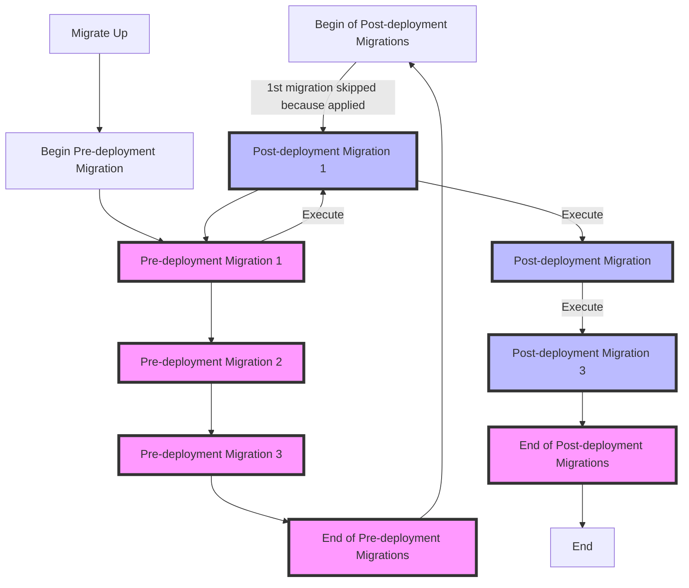

# Database Migrations

The PostgreSQL database schema migrations are managed through the `registry`
CLI. Internally, the registry is currently using the
[rubenv/sql-migrate](https://github.com/rubenv/sql-migrate) tool.

## Best Practices

The registry database migrations should adhere to the [GitLab database migrations style guide](https://docs.gitlab.com/ee/development/migration_style_guide.html)
whenever possible, considering that these applications are written in different
programming languages and use a different set of tools.

### Idempotency

All migrations must be idempotent. `IF EXISTS` and `IF NOT EXISTS` conditions
must be used whenever possible. Suppose these do not apply to a given operation,
such as adding a constraint to an existing table. In that case, a guard clause
should be added to the migration SQL statement to guarantee idempotency.

#### Examples

##### Add Constraint to Existing Table

```sql
DO $$
BEGIN
    IF NOT EXISTS (
        SELECT
            1
        FROM
            pg_constraint
        WHERE
            conrelid = 'public.repositories'::regclass
            AND conname = 'uq_repositories_path') THEN
        ALTER TABLE public.repositories
            ADD CONSTRAINT uq_repositories_path UNIQUE (path);
    END IF;
END;
$$;
```

##### Create Trigger

`CREATE OR REPLACE` for triggers is only supported on PostreSQL 14, so we need a custom idempotent `CREATE`:

```sql
DO $$
  BEGIN
    IF NOT EXISTS (
            SELECT
            FROM
              pg_trigger
            WHERE
              tgname = 'gc_track_deleted_layers_trigger'
              AND tgrelid = 'layers'::regclass) THEN
      CREATE TRIGGER gc_track_deleted_layers_trigger
        AFTER DELETE ON layers REFERENCING OLD TABLE AS old_table
        FOR EACH STATEMENT
      EXECUTE FUNCTION gc_track_deleted_layers ();
    END IF;
  END
$$
```

If replacing an existing trigger in a single migration (`DROP` existent followed by `CREATE` new), there is no need to
do this check as the trigger is guaranteed to no longer exist after the `DROP` statement.

##### Insert Rows

When inserting rows on tables we should take care to ensure idempotency. This means
that trying to insert a row that is already there should not result in an error.

The simplest approach is an `INSERT ... ON CONFLICT DO NOTHING` query, such as:

```sql
INSERT INTO media_types (media_type)
    VALUES ('my.media.type.1'), ('my.media.type.N')
ON CONFLICT
    DO NOTHING;
```

However, if the target tables have a `smallint` as primary key, which is the case
for `media_types`, we should avoid unnecessary increments to the primary key
sequence, which will happen for every insert where the `ON CONFLICT` clause is
triggered, i.e., the row(s) already exist. Therefore, we should use the following
strategy for these situations:

```sql
INSERT INTO media_types (media_type)
    VALUES ('my.media.type.1'), ('my.media.type.N')
EXCEPT
SELECT
    media_type
FROM
    media_types;
```

Please note that this is not appropriate for large and/or partitioned tables, as it triggers a scan on the whole table to eliminate rows it might insert.

##### Long-Running Migrations

For (usually post-deployment) migrations that contain statements expected to take a considerable amount of time to
complete when applied to a production database (e.g. when creating indexes or validating constraints), we must wrap all
`Up` statements with `SET statement_timeout TO 0` and
`RESET statement_timeout` instructions. This will ensure that the default statement timeout
(e.g. 15 seconds for GitLab.com) does not apply and cause the statement to fail. See migration
[`20221129145757_post_add_layers_simplified_usage_index_batch_2`](https://gitlab.com/gitlab-org/container-registry/blob/85d0fe473c2fc167cc3ca0c1c08752a0498a839c/registry/datastore/migrations/20221129145757_post_add_layers_simplified_usage_index_batch_2.go)
for an example.

### Schema Migration Process

The migration system establishes a clear distinction between migrations that must run before the registry starts (i.e. pre-deploy) and those that may run after (i.e. post-deploy). All existing schema migrations are explicitly assigned to either of these categories based on the limitations of the migration (e.g. how long it takes to execute). This classification enables better management and versioning of different types of database changes.

#### Execution Order

The migration command enforces a strict execution order: all pre-deployment migrations run first, followed by all post-deployment migrations. The system supports a dependency graph between the different types of migrations. 

A pre-deployment migration can declare dependencies on specific post-deployment migrations, allowing for complex migration scenarios. For example, a pre-deployment migration that creates a new column may need to ensure that a post-deployment migration has already created the table it depends on. When such dependencies exist, the system will ensure that when running the `migrate up` command, the required post-deployment migrations for any pre-deployment migrations that have not yet been executed are executed before continuing to execute the following pre-deployment migrations. 

In the case where post-deployment migrations are skipped (e.g. using the `--skip-post-deployment` flag) and there are unsatisfied post-deployment dependencies for the pre-deployment migrations that have not yet been executed, the system will block execution and notify the user of unsatisfied dependencies. In this case, the user will need to run the `migrate up` command again without the `--skip-post-deployment` flag.

It is worth noting that due to the enforced execution order (i.e. pre-deploy before post-deploy), a post-deployment migration cannot technically require a pre-deployment migration that hasn't been executed yet. In the case where a pre-deployment migration has dependencies on post-deployment migrations, the system ensures that the necessary post-deployment migrations are executed first to resolve the dependency. Once all pre-deployment migrations are completed, only then will the remaining post-deployment migrations execute. This guarantees that all the required changes from pre-deployment migrations are in place before any post-deployment migrations are applied.



In the above example Pre-deployment Migration 1 depends on Post-deployment Migration 1 hence it is executed in the pre-deploy run as opposed to the posy-deploy run.

#### Commands

The migration system supports several key operations:

1. **Up Migrations**: Applies pending migrations in the correct order, respecting dependencies between pre-deployment and post-deployment migrations.

1. **Down Migrations**: Reverts migrations in the reverse order of application - first removing post-deployment migrations, then pre-deployment migrations.

1. **Status**: Displays two separate status tables showing which migrations of each type have been applied.

1. **Version**: Shows the most recent migration version for both pre-deployment and post-deployment migrations, allowing for quick verification of the database state.

## Development

### Create Database

Please make sure to create a `registry_dev` and `registry_test` (naming
suggestion) database in your development PostgreSQL 13 instance before running
migrations.

#### Example

```plaintext
psql -h localhost -U postgres -w -c "CREATE DATABASE registry_dev;"
```

### Create New Migration

To create a new database migration run the following command from the root of
the repository:

```plaintext
make db-new-migration [name]
```

A new migration file, named `[timestamp]_[name].go`, will be created under
`migrations/`. Migration files are prefixed with the timestamp of the current
system date formatted as `%Y%m%d%H%M%S`. 

Depending on whether the migration is required for pre-deployment or post-deployment,
move the newly created migration file into the corresponding
`predeployment/` or `postdeployment/` subdirectory within `migrations/`.

Make sure to use a descriptive name for the migration, preferably denoting the
`action` and the object `name` and `type`. For example, to create a table `x`,
use `create_x_table`. To drop a column `a` from table `x`, use `drop_x_a_column`.
The name can only contain alphanumeric and underscore characters.

New migrations are created based on a template, so we just need to fill in the
list of `Up` and `Down` SQL statements.

If applicable, specify migration dependencies by adding the reference ID of the required
migration to either:

- `RequiredPreDeploy`: for post-deploy migrations that rely on existing pre-deploy migrations.
- `RequiredPostDeploy`: for pre-deploy migrations that depend on existing post-deploy migrations.

All `Up` and `Down` statements are executed within a transaction.

#### Example

```plaintext
$ make db-new-migration create_users_table
OK: ./registry/datastore/migrations/20200713143615_create_users_table.go
```

#### Disabling DDL Transactions

By default all up and down SQL statements in a migration run within a transaction.
Some operations, such as creating an index concurrently, cannot be executed inside
a transaction. To disable transaction mode you can set the migration
`DisableTransactionUp` and/or `DisableTransactionDown` attributes to `true`.

### Partitioned Tables

Integration tests use 4 partitions per table instead of the default 64 to reduce bootstrap and teardown time while maintaining test coverage.

When modifying partitioned tables, create separate migration files:

1. For integration tests (4 partitions):
   - Use build tag `//go:build integration`
   - Only included when building for integration CI jobs

1. For production (64 partitions):
   - Use build tag `//go:build !integration`
   - Excluded from integration tests

#### Example

When adding an index on column `foo` to the `tags` table:

- `YYYYMMDDHHMMSS_create_tags_foo_index_testing.go`
  - Creates index for partitions 0..3
  - Build tag: `//go:build integration`

- `YYYYMMDDHHMMSS_post_create_tags_partitions_foo_index.go`
  - Creates index for partitions 0..64
  - Build tag: `//go:build !integration`

- `YYYYMMDDHHMMSS_post_create_tags_foo_index.go`
  - Creates index for parent table
  - No build tag (applies to all environments)

## Administration

Database migrations are managed through the `registry` CLI, using the `database
migrate` command:

```plaintext
$ registry database migrate --help config.yml
Usage:
  registry database migrate [flags]
  registry database migrate [command]

Available Commands:
  up          Apply up migrations
  down        Apply down migrations
  status      Show migration status
  version     Show current migration version

Flags:
  -h, --help   help for migrate

Use "registry database migrate [command] --help" for more information about a command.
```

### Pre-Requisites

- A PostgreSQL 13 database for the registry must already exist;
- The database should be configured under the `database` section of the registry
  `config.yml` configuration file. Please see the [configuration docs](https://gitlab.com/gitlab-org/container-registry/-/blob/database/docs/configuration.md#database)
  for additional information;
- The `registry` binary, built from the source. See the [`Building` section of development environment setup doc](development-environment-setup.md#building) for more
  details.

### Metrics

There are metrics that track the number of total and applied migrations.

Total count of migrations:

- `registry_database_migrations_total{migration_type="pre_deployment"}` - Total count of pre-deployment migrations

- `registry_database_migrations_total{migration_type="post_deployment"}` - Total count of post-deployment migrations

Number of applied migrations:

- `registry_database_rows{query_name="applied_pre_migrations"}` - Number of applied pre-deployment migrations

- `registry_database_rows{query_name="applied_post_migrations"}` - Number of applied post-deployment migrations

The number of pending migrations can be calculated by subtracting the number of applied
migrations from the number of total migrations. For example, this will give you the number
of pending post deployment migrations:

```promql
max(registry_database_migrations_total{migration_type="post_deployment"}) -
max(registry_database_rows{query_name="applied_post_migrations"})
```

### Apply Up Migrations

To apply pending up migrations use the `up` sub-command:

```plaintext
$ registry database migrate up --help config.yml
Apply up migrations

Usage:
  registry database migrate up [flags]

Flags:
  -d, --dry-run     do not commit changes to the database
  -h, --help        help for up
  -n, --limit int   limit the number of pre-migrations (all by default)
  -p, --post-deploy-limit int   limit the number of post-migrations (all by default)
  -s, --skip-post-deployment   do not apply post deployment migrations
```

If using the `--dry-run` flag, a migration plan (an ordered list of migrations
to apply) will be created and displayed but not executed. Additionally, it is
possible to limit the number of pending migration to apply using the `--limit`
flag. By default, all pending migrations are applied.

If using the `--skip-post-deployment` flag, post-deployment migrations will
not be applied. Post-deployment migrations can be applied after the registry
service is active by running the `up` subcommand again without the
`--skip-post-deployment` flag. Alternatively, the
`SKIP_POST_DEPLOYMENT_MIGRATIONS` environment variable can be set to `true` or
`1`, but the flag takes precedence when specified. By default, all pending
migrations are applied.

#### Example

Apply 1 pre-deployment migration:

```plaintext
$ registry database migrate up -n 1 config.yml
20200713143615_create_users_table
OK: applied 1 pre-deployment migration(s), 0 post-deployment migration(s) and 0 background migration(s)
```

Apply 1 post-deployment migration:

```plaintext
$ registry database migrate up -p 1 config.yml
20200713143615_create_users_table
OK: applied 0 pre-deployment migration(s), 1 post-deployment migration(s) and 0 background migration(s)
```

### Apply Down Migrations

To apply pending down migrations (rollback) use the `down` sub-command:

```plaintext
$ registry database migrate down --help config.yml
Apply up migrations

Usage:
  registry database migrate up [flags]

Flags:
  -d, --dry-run     do not commit changes to the database
  -h, --help        help for up
  -n, --limit int   limit the number of migrations (all by default)
  -f, --force       no confirmation message
```

`--dry-run` and `--limit` flags also apply to the `down` command, and they work
as described for the `up` command.

Unlike the `up` command, for safety reasons, the `down` command requires
explicit user confirmation before applying the planned migrations. The `--force`
flag can be used to bypass the confirmation message.

#### Example

```plaintext
$ registry database migrate down config.yml
pre-deployment:
20200713143615_create_users_table
20200527132906_create_repository_blobs_table
20200408193126_create_repository_manifest_lists_table
20200408192311_create_repository_manifests_table
20200319132237_create_tags_table
20200319132010_create_manifest_list_manifests_table
20200319131907_create_manifest_lists_table
20200319131632_create_manifest_layers_table
20200319131542_create_configurations_table
20200319131222_create_blobs_table
20200319130108_create_manifests_table
20200319122755_create_repositories_table
Preparing to apply down migrations. Are you sure? [y/N] y
OK: applied 12 pre-deployment migration(s) in 121.334s

post-deployment:
20220319122755_create_index_on_manifest_table
Preparing to apply down migrations. Are you sure? [y/N] y
OK: applied 1 post-deployment migration(s) in 0.077s
```

### Status

To check the status of database migrations use the `status` sub-command:

```plaintext
$ registry database migrate status --help config.yml
Show migration status

Usage:
  registry database migrate status [flags]

Flags:
  -h, --help                   help for status
  -s, --skip-post-deployment   ignore post deployment migrations
  -u, --up-to-date             check if all known migrations are applied
```

The `status` sub-command displays a list of all migrations, including known (the
ones packaged in the executing `registry` binary) and unknown (the ones not
packaged in the `registry` binary but somehow applied in the database). The
applied timestamp (if any) is also displayed.

To facilitate programmatic state checks, when using the `--up-to-date` flag,
the output is simply `true` or `false`, depending on whether all known
migrations are applied or not. The `--skip-post-deployment` flag can be used
to ignore post-deployment migrations. Alternatively, the
`SKIP_POST_DEPLOYMENT_MIGRATIONS` environment variable can be set to `true` or
`1`, but the flag takes precedence when specified.

#### Example

```plaintext
$ registry database migrate status config.yml
+--------------------------------------------------------+---------------------------------------+
|                       MIGRATION                        |                APPLIED                |
+--------------------------------------------------------+---------------------------------------+
| 20200319122755_create_repositories_table               | 2020-07-13 14:49:22.502491 +0100 WEST |
| 20200319130108_create_manifests_table                  | 2020-07-13 14:49:22.508141 +0100 WEST |
| 20200319131222_create_blobs_table                      | 2020-07-13 14:49:22.513534 +0100 WEST |
| 20200319131542_create_configurations_table             | 2020-07-13 14:49:22.53986 +0100 WEST  |
| 20200319131632_create_manifest_layers_table            | 2020-07-13 14:49:22.545756 +0100 WEST |
| 20200319131907_create_manifest_lists_table             | 2020-07-13 14:49:22.553113 +0100 WEST |
| 20200319132010_create_manifest_list_manifests_table    | 2020-07-13 14:49:22.585516 +0100 WEST |
| 20200319132237_create_tags_table                       | 2020-07-13 14:49:22.594482 +0100 WEST |
| 20200408192311_create_repository_manifests_table       | 2020-07-13 14:49:22.601056 +0100 WEST |
| 20200408193126_create_repository_manifest_lists_table  | 2020-07-13 14:49:22.613399 +0100 WEST |
| 20200527132906_create_repository_blobs_table (unknown) | 2020-07-13 14:49:22.639496 +0100 WEST |
| 20200713143615_create_users_table                      |                                       |
+--------------------------------------------------------+---------------------------------------+
```

```plaintext
$ registry database migrate status --up-to-date config.yml
false
```

### Version

The `version` sub-command displays the currently applied database migration.

#### Example

```plaintext
$ registry database migrate version config.yml
20200527132906_create_repository_blobs_table
```
