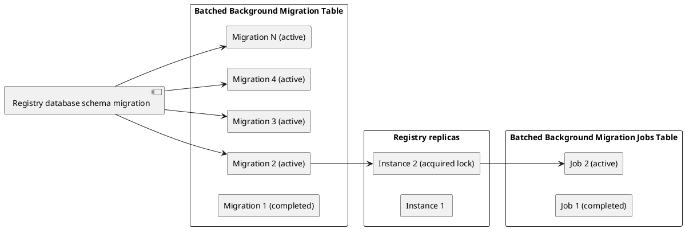
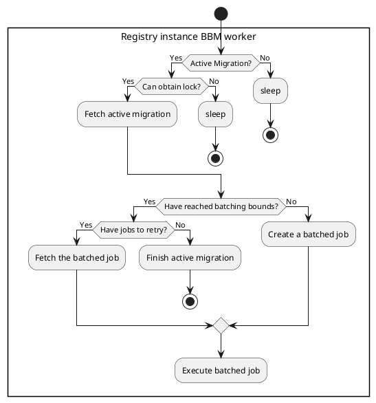
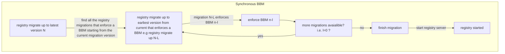

# Proposal

## Batch Background migration (BBM) creation

A batched background migration will be created by inserting a record containing the metadata of the background migration into a new `batched_background_migrations` table in the registry database. This insert will be done via a regular database migration and then the migration jobs can be created and triggered asynchronously after a successful regular database migration, when the registry begins to serve traffic.

Taking [inspiration from the rails background migration](https://gitlab.com/gitlab-org/gitlab/-/blob/master/db/structure.sql?ref_type=heads#L5122) we should aim to have a simple table with the following structure:

**Background migration database structure**

```sql
CREATE TABLE batched_background_migrations (
    id bigint NOT NULL GENERATED BY DEFAULT AS IDENTITY,
    name text UNIQUE,
    created_at timestamp with time zone NOT NULL,
    updated_at timestamp with time zone NOT NULL,
    min_value bigint DEFAULT 1 NOT NULL,
    max_value bigint NOT NULL,
    batch_size integer NOT NULL,
    status smallint DEFAULT 0 NOT NULL,
    job_signature_name text NOT NULL,
    table_name text NOT NULL,
    column_name text NOT NULL,
    CONSTRAINT pk_batched_background_migrations PRIMARY KEY (id)
);
```

- `min_value`: Starting row `id` eligible for migration.
- `name`: a unique name that identifies the migration (ideally, all names should follow the format `<timestamp>_<migration_description>`)
- `max_value`: Stopping row `id` eligible for migration. To exclude newly introduced records after a given point.
- `batch_size`: Number of rows that should be migrated per batch.
- `job_signature_name`: The key that corresponds to a registry function that will be executed for each batch of the migration.
- `table_name`: The table the migration is run on. Must follow the format `<schema>.<table>`.
- `column_name`: The column used to determine the next batch.
- `status`: The current state of the migration:

| status     | value | description                                                                                                                                                                                                                                   |
| ---------- | ----- | --------------------------------------------------------------------------------------------------------------------------------------------------------------------------------------------------------------------------------------------- |
| `paused`   | 0     | In this state no (new) jobs for the migration will be created/run and no failed jobs for the migrations will be retried. Already active jobs that were updated to this status will be allowed to either run to successful completion or fail. |
| `active`   | 1     | In this state a migration has not been started and will be eligible to be picked up as soon as a job worker is available.                                                                                                                     |
| `finished` | 2     | In this state a migration is deemed complete (i.e. all batched jobs associated with the migration have been run to successful completion and the migration has reached its batching bounds)                                                   |
| `failed`   | 3     | The migration is marked as `failed` when at least one of the migration jobs has exceeded the maximum retry `attempts`. At this stage manual intervention is required.                                                                         |
| `running`  | 4     | The migration is ongoing (i.e. at least one job associated with the migration is not completed)                                                                                                                                               |

## Batch Background migration execution

There are two ways a registry batched background migration job should be executed:

- Asynchronously when serving requests on the registry
- Synchronously during a regular migration

### Asynchronous Execution when serving requests on the registry

This is the default way that BBM will run, In this case a BBM introduced via the regular migration (as explained above) will be picked up by one of the registry server instances (after first acquiring a lock on BBMs). Once a registry instance has acquired the lock, it will proceed to create a BBM job, execute it and release the lock.

A BBM job is the unit work that creates and executes a singular batch of the migration. To co-ordinate with other registry instances and for visibility on the status of jobs, a BBM job table is required. Again, taking some [inspiration from the rails background migration](https://gitlab.com/gitlab-org/gitlab/-/blob/master/db/structure.sql?ref_type=heads#L5096) we should aim to have a table with the following structure: 

**Batched Background migration job database structure**

```sql
CREATE TABLE batched_background_migration_jobs (
    id bigint NOT NULL GENERATED BY DEFAULT AS IDENTITY,
    created_at timestamp with time zone NOT NULL,
    updated_at timestamp with time zone NOT NULL,
    started_at timestamp with time zone,
    finished_at timestamp with time zone,
    batched_background_migration_id bigint NOT NULL,
    min_value bigint NOT NULL,
    max_value bigint NOT NULL,
    status smallint DEFAULT 1 NOT NULL,
    failure_error_code smallint,
    attempts smallint DEFAULT 0 NOT NULL,
    CONSTRAINT pk_batched_background_migrations_job PRIMARY KEY (id),
    FOREIGN KEY(batched_background_migration_id) REFERENCES batched_background_migrations(id),
    CONSTRAINT fk_b_b_m_jobs_batched_background_migration_id_b_b_migrations FOREIGN KEY (batched_background_migration_id) REFERENCES batched_background_migrations(id) ON DELETE CASCADE
);

```

- `batched_background_migration_id`: References the batched background migration the job is tied to.
- `min_value`: The starting `id` for the batch job.
- `max_value`: The stopping `id` for the batch job.
- `attempts`: How many times the batch job was tried.
- `status`: The current state of the job:

| status     | value | description             |
| ---------- | ----- | ----------------------- |
| `active`   | 1     | The job is in progress. |
| `finished` | 2     | The job is in finished. |
| `failed`   | 3     | The job is in failed.   |

- `failure_error_code`: The last error code associated with a `failed` job state. This corresponds to error codes emitted by the registry when a job fails:

| error code              | value | description                                                     |
| ----------------------- | ----- | --------------------------------------------------------------- |
| `unknown`               | 0     | The job/migration failed with an unknown error code             |
| `invalid_bbm_table`     | 1     | Invalid migration table reference                               |
| `invalid_bbm_column`    | 2     | Invalid background migration column reference                   |
| `invalid_job_signature` | 3     | Invalid job signature reference                                 |
| `max_job_retry`         | 4     | A migration's job exceeded the maximum configured retry attempt |

The registry will be aware of new migrations or ongoing/unfinished migrations by monitoring/ querying the BBM table (periodically) on a separate go-routine, if an unfinished migration exists the registry will attempt to acquire the BBM lock and then proceed to either:

- **A** create the next BBM job batch for an unfinished migration.
- **B** mark a migration as finished if the migration bounds were reached and all jobs are complete.
- **C** retry BBM jobs for an unfinished migration that had failed a priori - A failed job is retried until a hard coded maximum attempt is reached, at which case the job, and its corresponding migration should be marked as failed and should be investigated further.





#### Example Use Case

**Problem**

We need to copy all the values in `column_A` to `column_B` in some table `dummy_table`.

**Implementation**

1. Create a function that encapsulates a BBM (e.g. `CopyColumnAToColumnB(ctx context.Context, store datastore.DB, column_name string, min_value, max_value int) error {...}`)
1. Register the function in a global map that will be used to lookup job names to job functions (e.g. `var bbmFunctions =map[string]func(....){"CopyColumnAToColumnB":CopyColumnAToColumnB}`). More on the use of this in 6.
1. We can now activate the BBM in the registry via a regular database migration (e.g. `INSERT INTO batched_background_migrations ("created_at", "updated_at", "min_value", "max_value", "batch_size", "status", "job_signature_name", "table_name", "column_name")
VALUES (NOW(), NOW(), 1, (SELECT MAX("id") FROM dummy_table),  2, 1, 'CopyColumnAToColumnB', 'dummy_table', 'id');`)
1. Upon starting (and on a fixed interval with a random jitter thereafter), the registry will start a worker (asynchronously) to first acquire a distributed lock and then fetch any active BBM from the `batched_background_migrations` table one at a time. e.g. `SELECT id, min_value, max_value, batch_size, status, job_signature_name, table_name, column_name FROM batched_background_migrations WHERE (status = 1 OR status = 4) ORDER BY id ASC LIMIT 1`

  The distributed lock is used for coordinating migrations between all running registry instances. We co-ordinate with all instances to make sure only one migration (and ultimately 1 job is run at any given time). This is a constraint put on the first iteration for simplicity, but there is no reason why we can't have coordinated migrations run concurrently in future iterations (if need be). 

  _NOTE_: The proposed distributed lock will be acquired on postgres -- `SELECT pg_try_advisory_lock(${lockID})` -- and will require pg_bouncer in transaction pooling mode.

1. Once the lock is acquired and if an active BBM is found in the `batched_background_migrations` table the registry will either:

  **A.** Create a BBM "job" for the BBM in `batched_background_migration_jobs`. The created job will reference (via a foreign key constraint) the BBM ID that triggered in the `batched_background_migrations`. e.g. `INSERT INTO batched_background_migration_jobs (created_at,updated_at,batched_background_migration_id,min_value,max_value,status) VALUES ($1,$2,$3,$4,$5,$6)`
  **B.** Pick up any failed job associated with the BBM in scope. Failed jobs will only be picked when all batches of a migration have been created and executed at least once to avoid getting stuck on one job on the first pass.
  **C.** Mark the BBM as failed if any of the BBM jobs have reached a maximum failed attempt (configurable in the registry as a constant)

  When creating the job entry in `batched_background_migration_jobs` we will need to determine where a specific job starts and where it ends (i.e. because the next created job for the BBM depends on the endpoint of the last created job for the same BBM). We will determine the next bounds using key-set pagination, for which we will need to know the `column_name` and `table_name` to paginate over, the `min_value` and `max_value` to be used as the "after" and "before" cursors for the pagination and the limit of the batch `batch_size` for the BBM. (e.g. `SELECT $column_name FROM $table_name WHERE (id >= $min_value AND id <= $max_value) ORDER BY id LIMIT $batch_size`) 

1. Assuming we can create a job we will also want to execute the job. The `job_signature_name` column of the `batched_background_migrations` serves as the key that references the BBM work function in the map created in 2. To actually perform the job we need to look up which BBM function it performs and call that function. In this case we look up "CopyColumnAToColumnB" from `bbmFunctions` and end up calling the associated `CopyColumnAToColumnB`func

1. Once a job has been executed the lock is released by the executing process for another process to use if need be.

The process of acquiring the distributed lock, searching for active migrations, creating and then executing a job is repeated multiple times (by potentially different instances of the registry) until all `active` migrations have reached either a `finished` or `failed` state.

Retry and status updates logic have been left out of this example in order to focus on providing a general structure of how the BBM will be implemented. See [retry and recovery](#retry-and-recovery).

### Synchronous Execution during a regular migration

As part of the current registry startup process, all regular schema migrations must be run before the registry can begin serving traffic. Since BBMs are linked to regular schema migrations, a BBM may be enforced as a dependency for any regular migration. This dependency means that if a BBM required by a regular migration is incomplete, the regular migration process will be halted, preventing the registry from starting.

Ideally, all BBMs should have been completed [asynchronously](#asynchronous-execution-when-serving-requests-on-the-registry), but there are instances where enforced BBMs may not be complete, such as when an admin updates to a registry version requiring a BBM that was never run but is enforced on the new version. In such cases, the registry will not start (and the migrate command that is part of the registry startup process will be halted) until all enforced BBMs are completed.

Admins must manually run enforced BBMs if the registry startup process detects incomplete BBMs during migration. To facilitate this, a `--sync-background-migrations` flag will be added to the migrate CLI, allowing admins to rerun pending/incomplete migrations and wait for the enforced BBMs to complete.

Running BBMs synchronously is not ideal as it delays the registry from serving traffic, but it ensures that necessary background migrations are completed, allowing registry developers to confidently enable new features and migrations.

**_NOTE_**: Enforcement of a BBM during a regular migration should occur only after a stop upgrade to avoid blocking users unexpectedly. Ideally, the BBM would have been completed in a prior registry version before the enforcement is introduced. 

A synchronous BBM is run manually as part of the registry `registry migrate up --sync-background-migrations` CLI and will follow the same batched job pattern explained in [Asynchronous Execution when serving requests on the registry](#asynchronous-execution-when-serving-requests-on-the-registry), with the exemption that the [`registry migrate`](https://gitlab.com/gitlab-org/container-registry/-/blob/master/docs/database-migrations.md?ref_type=heads#administration) process itself is the only "worker" that creates and runs the batch jobs in quick succession (one by one - not on an interval).
In the case that a migration job is already in progress (by an existing registry instance) the worker will keep trying to acquire the lock until a dedicated timeout. This can be done by opening a transaction and trying to take the lock with a high timeout. After the running batch finishes the `migrate` process will be at the top of the queue and get the lock to begin creating and executing BBM jobs.

#### Running BBM with regular migrations ( `registry migrate up --sync-background-migrations`)

To run BBMs with regular migrations we could maintain a mapping between regular database migration versions and the enforced background migration in the registry codebase.
Then, before running the regular database migration (i.e. `registry migrate up --sync-background-migrations`) to the latest version, first assert that there are no BBMs that are unfinished/not-started that depend on any of the newer regular migration versions to be introduced. In the case that there are no dependent BBMs to be executed we run the regular migration to the latest version.
However, in the case where some dependent BBMs are unfinished or not yet started, we first run the regular migration to the version that enforces the first unfinished/un-started BBM, then we try to run the enforced BBM of the version to completion, once the enforced BBM is completed we repeat the process until we reach the latest version.

To do this we will need to extend the [Migration](https://gitlab.com/gitlab-org/container-registry/-/blob/c62d5b393c2366f645e6424ab88c2af7c3044f82/registry/datastore/migrations/migrations.go#L9-9) structure to have a new attribute `EnsureBBMBefore []string`. The new attribute will hold the `name` of each BBM that needs to be completed before the migration can run.

We will also need to modify the `migrate up --sync-background-migrations` command to implement a "staggered" regular migration only up to the next migration version with an `EnsureBBMBefore` attribute that is not empty. Once it encounters a version with an `EnsureBBMBefore` that is not empty the migrate command must first assert the specified BBM for the regular migration version is complete (and if it is not, must complete it before proceeding to the next migration). The step is repeated for each migration version higher until we have completed the migration.



## Retry and Recovery

Each Migration is run once and each job in a migration can be run up to a configurable `MaxJobAttempts` constant in the registry codebase. We can set `MaxJobAttempts` to `3` (same as rails) initially and later evaluate if we need to increase or reduce this value in the future.

All migration jobs are guaranteed to be run only once before any failed jobs can be retried. After all jobs have been run at least once the registry then proceeds to run each failed jobs up to `MaxJobAttempts`. If any of the failed job's retry attempts (from `attempts` in `batched_background_migration_jobs` table) exceeds the value of `MaxJobAttempts` (in the registry codebase) the migration is marked as failed regardless of other successful jobs in the BBM. A failed BBM is not retried and will require manual intervention to assess the issue. Failed BBM are rare but if/when they do happen it requires some investigation. On `gitlab.com` we should raise an alert in our alerting channel whenever a BBM is marked as failed.

Keep in mind that a job (whether `failed` or `active`) can only be created and/or executed in the interval of time that an asynchronous job worker is active (i.e. the period of time that the worker runs and if the worker obtained the lock) and once a job is executed the worker will release the lock for another worker to pick up and run for subsequent jobs. This reduces any potential error biases in runs between workers.

Ultimately, a failed BBM does not degrade the registry when it happens as part of the asynchronous BBM. It is up to the registry developer to enforce that a BBM is completed (using the assurance mechanism explained in [Synchronous Execution during a regular migration](#synchronous-execution-during-a-regular-migration)) before using functionality introduced by the BBM within the registry codebase.

_Note_: A failed BBM can always be re-run by changing the `status` of the BBM to `active` and setting the failed jobs for the BBM (in `batched_background_migration_jobs`)to have `attempts=0`. Exposing functionality to reset failed jobs is part of the scope of the CLI.

## CLI

The CLI will expose the following functionality:

- Summarize the status of all registry batched migrations and jobs available in the database: this will be necessary for users to monitor migration status and for auditing purposes.
- Refresh failed migrations: this will help in making failed jobs associated with failed migrations eligible to be retried again.

## Release process

### Introducing a background migration

It is important to always introduce a background migration well in advance of any feature that uses the functionality introduced by the migration. This ensures that customers have had sufficient time to and headroom for the BBM to run. To introduce a BBM to the registry:

- Register your new background migration function in the registry codebase and associate it with a name (e.g. `MigrationNameKeyInCode`). This is the name that you will need to specify in the `job_signature_name` column when inserting your BBM in the `batched_background_migrations` table in the next step.
- Add your background migration to `batched_background_migrations` in a database migration. For example: `INSERT INTO batched_background_migrations ("created_at", "updated_at", "min_value", "max_value", "batch_size", "job_signature_name", "table_name", "column_name") VALUES (NOW(), NOW(), 1, (SELECT MAX("id") FROM dummy_table), 2, 'MigrationNameKeyInCode', 'dummy_table', 'id');`.
- Monitor the status of your background migration by using the CLI or by checking the migration status in `batched_background_migrations` table.

### Required stops

In the registry version where the functionality introduced by the background migration will be used we must make sure that we also introduce a regular migration that enforces the required BBM (see: [Running BBM with regular migrations](#running-bbm-with-regular-migrations--registry-migrate-up---sync-background-migrations)). This ensures that the registry will never start unless the regular migrations (with their BBM dependencies - if any) runs to completion. This is useful in avoiding situations where a BBM introduced feature is required by a registry version but is not present because the BBM was not completed. 

A [required stop](https://docs.gitlab.com/ee/development/database/required_stops.html) is a perfect place to enforce a BBM dependency on a regular migration.

## Out of scope of first iteration

- Concurrent migration processing: To reduce complexity, for the first iteration only one migration and one job can be run at a time.

- Batching strategy: To reduce complexity the first iteration will only support primary key batching (i.e. creating job batches based on a primary key). This is the default in rails.

- Sub batching: It is often beneficial to run a dedicated migration query in a job batch on one "sub" batch (a smaller division of your batch) at a time. Although this is very useful I think we can consider introducing this when the need arises, for the time being we can make our batch small enough to satisfy our own constraints.
- Dynamic optimization of batch sizes: Rails can optimize the batch size per job based on how long a prior job took.
- API for status: While having an API to gauge the migration status would be nice, it wouldn't add a huge benefit than having the CLI command for checking the status, especially given as only admins will be able to access the APIs anyway.
- CLI functionality for pausing migrations.
- Down migrating BBM.
