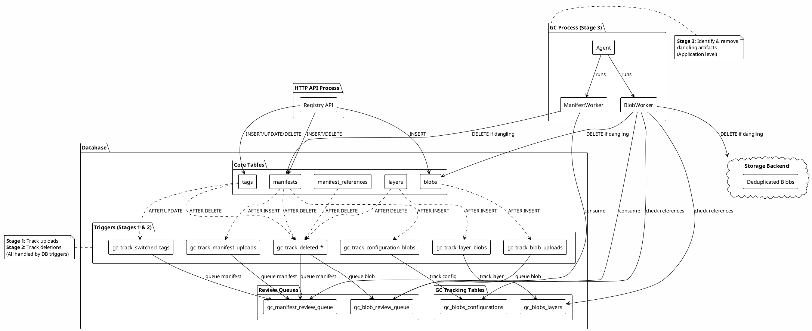
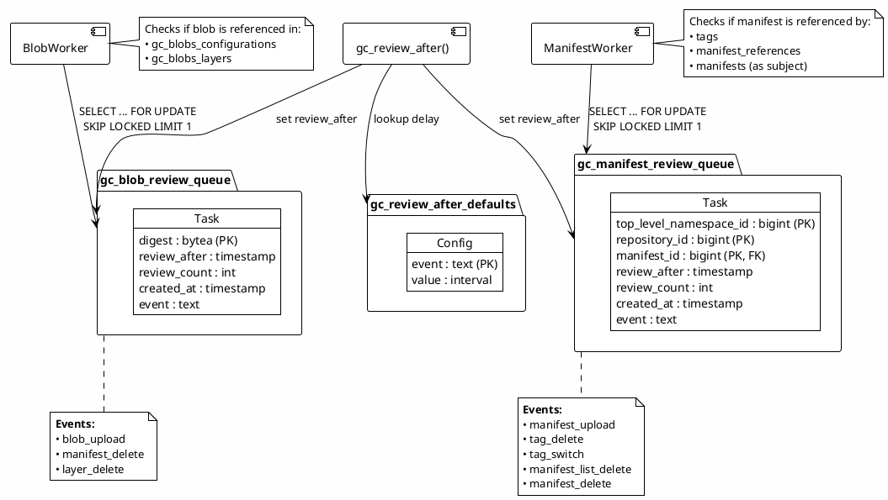
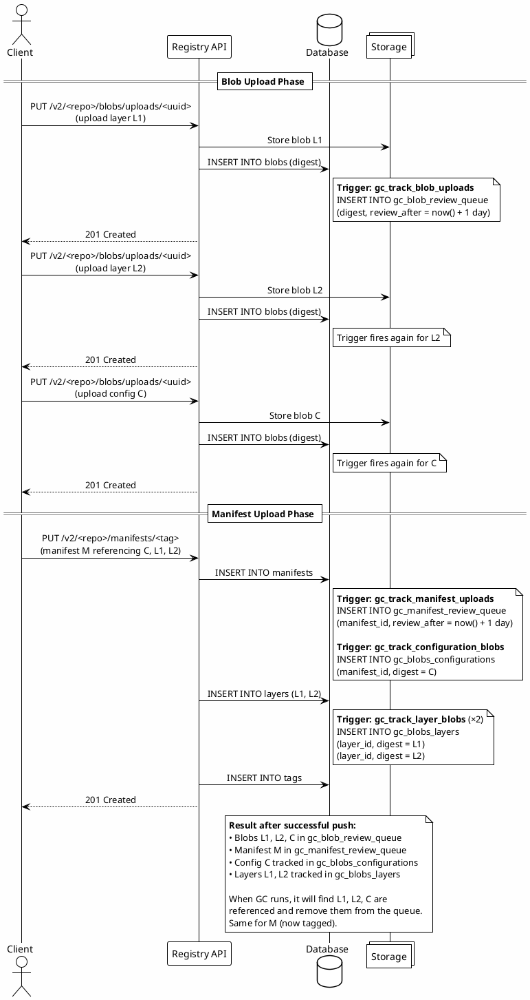
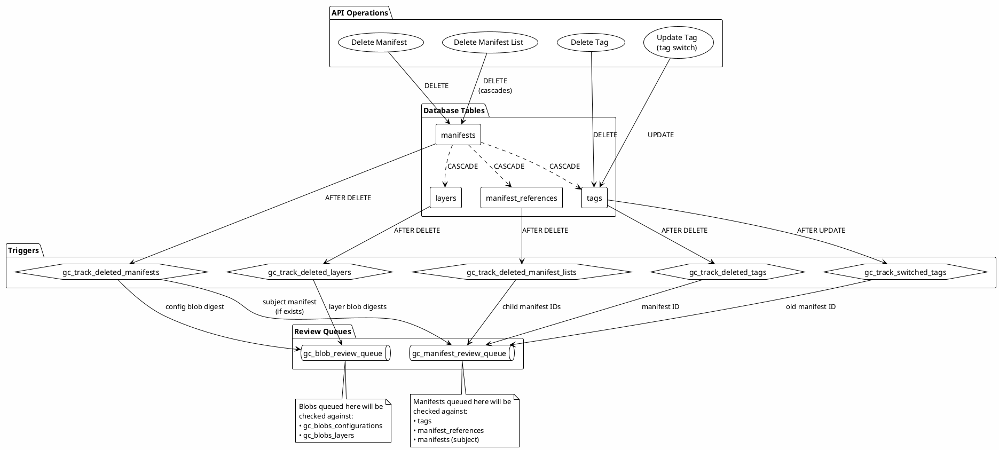
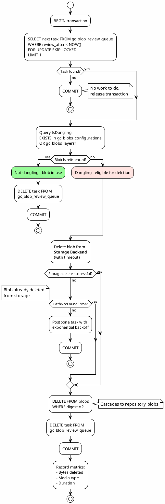
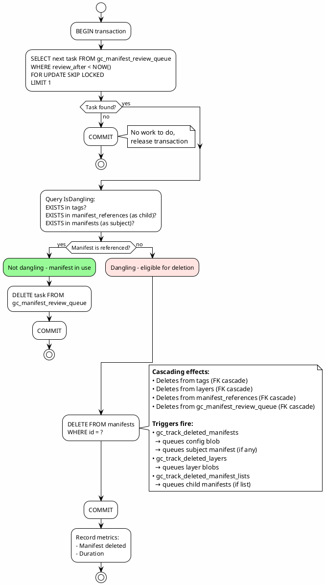
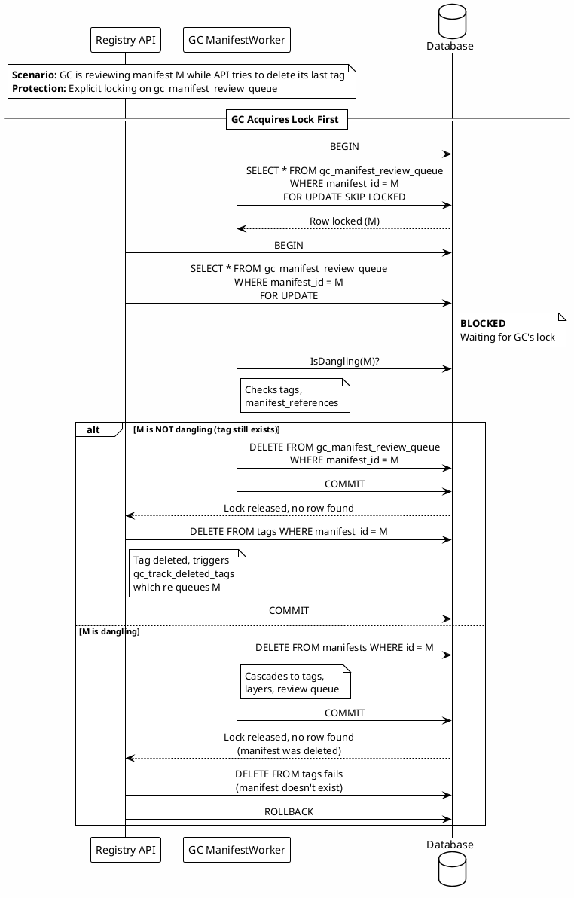
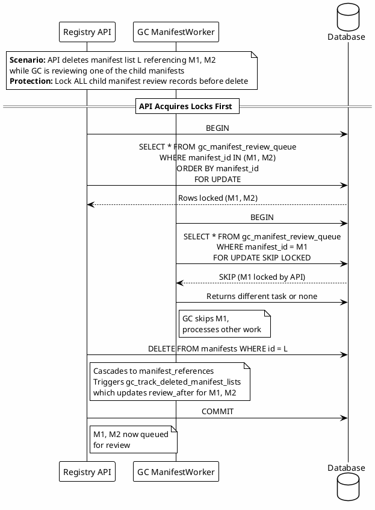
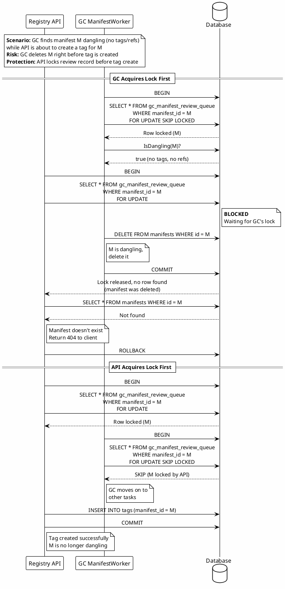
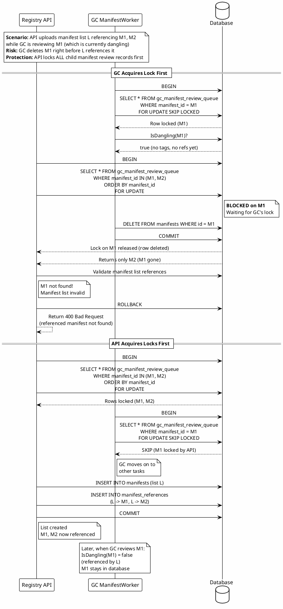

# Online Garbage Collection

In the registry storage backend, image configurations and layers are stored as blobs, deduplicated, and shared across repositories. Once in the deduplicated storage, blobs are "linked" to repositories that rely on them (similar to a symlink), allowing users with access to those repositories to download them.

As an example, when we push a Docker image which consists of configuration `C` and layers `L1` and `L2` to a repository `R1`, the `L1`, `L2` and `C` blobs will be uploaded to the deduplicated storage and then linked to repository `R1`. Next, if we push the same image to a different repository, `R2`, the `L1`, `L2`, and `C` blobs already exist in the deduplicated storage, and the only required operation is linking them to `R2`.

In this document, we describe an approach for online garbage collection based on the metadata database. The approach consists of three main stages:

1. Tracking blob and manifest uploads.
1. Tracking dangling blobs and manifests.
1. Identifying and removing dangling blobs and manifests.

As described in this document, stages 1 and 2 are operated by database triggers and not by the application (API).
Although the described logic can also be translated and implemented on the application side, we expect the process to be more efficient and reliable with database triggers.
These stages are mostly about reacting to the creation and deletion of data, making sense to rely on triggers for inserts and deletes.
By concentrating the logic in one place, instead of repeating it across all API routes, we also reduce the garbage collection footprint and the chances to introduce bugs.
Furthermore, by decoupling this logic from the API, we avoid incurring any performance penalty when serving the requests, as garbage collection occurs in the background.
We are also not prone to application crashes or bugs that could lead to untracked artifacts. We still can (and must) test all of the garbage collection scenarios with integration tests at the application level by manipulating data and observing the changes that happen as a result, so test coverage should not be an issue.
As a downside, observability is not as good as it could be if done at the application level, so special attention must be paid to new triggers and how they perform after being created.

On the contrary, stage 3 is handled at the application level. This process will leverage and act upon the database's work during stages 1 and 2 to actively identify and remove dangling artifacts. Therefore, it needs to happen at the application level, as connectivity to the storage backend is required. Being the last stage of garbage collection, where dangling artifacts are identified and removed, we can expose metrics and observe the garbage collection process. This should include metrics such as the number of reviewed and deleted blobs, the amount of space recovered in the storage backend after each run, and any errors that may occur.

## High-Level Architecture

The following diagram illustrates the overall architecture and the three stages of online garbage collection:



## Review queues

The online garbage collector is a continuous and concurrency safe background process, operating asynchronously from the HTTP API server's main registry process.

There is no direct communication between the main registry process and the garbage collector. Instead, communication is handled through a series of specialized tables that act as review queues. The HTTP API process inserts records to signal objects that may be eligible for deletion in these tables. The garbage collector then continuously selects records from them and determines if the corresponding objects are eligible for deletion.

**Note:** The details explained in this section are the minimum required to understand the remaining sections. Additional details will be provided as necessary.

The following diagram shows the structure of the review queues and how they interact with the GC workers:



### Blobs

A table named `gc_blob_review_queue` is used as a review queue for blobs that may be eligible for deletion in the deduplicated storage backend. This table has three primary columns:

- `digest`: The digest of the blob that may be eligible for deletion. This is used to query the database to determine if a blob is eligible for deletion and delete it from the storage backend.
- `review_after`: The minimum amount of time after which the garbage collector should pick up a record for review. Defaults to one day.
- `review_count`: The number of times the garbage collector reviewed a record. In conjunction with `review_after`, this field is used to implement an exponential backoff algorithm for failed reviews.
- `created_at`: The timestamp at which the task was first queued.
- `event`: The identifier of the _latest_ event that led to the task being queued (e.g. tag delete, manifest delete, etc.). Each trigger has its own event identifier.

### Manifests

A table named `gc_manifest_review_queue` is used as a review queue for manifest records that may be eligible for deletion in the database. For example, when deleting a tag that points to manifest `M` in repository `R`, manifest `M` should also be deleted **if** no other tag **and** no manifest list in repository `R` references manifest `M`.

Instead of handling this conditional cascade on delete logic at the application or database level in realtime (which increases complexity and the chances for race conditions), the review table is used to delegate that to the garbage collector.

This also enables us to toggle the automatic deletion of untagged/unreferenced manifests if needed (by disabling/enabling the consumption of this queue) and to postpone their deletion as we do for blobs, allowing users to re-tag/re-reference them for a short period before deleting them.

This table has four primary columns:

- `repository_id`: The repository of the manifest that may be eligible for deletion;
- `manifest_id`: The ID of the manifest that may be eligible for deletion within `R`;
- `review_after`: Same as for the blob review queue.
- `review_count`: Same as for the blob review queue.

### Review Delay

As explained above, both review queues have a `review_after` column, used to define the time after which the garbage collector should pick up a record for review. The default for this column is 1 day for both queues and all kinds of events, but it is possible to set a different default value through application settings. This is done using a special `gc_review_after_defaults` table, which has two columns:

- `event`: The name of the online GC event in response to which a record will be inserted in one of the queues (e.g., blob upload, tag delete, etc.);
- `value`: The interval to add to `now()` when setting `review_after` during a review queue insert.

This table gives us the flexibility to use different delays depending on the event that the online GC triggers are reacting to. We can also change them at runtime, either "permanently" (at boot time, in response to an application configuration change) or temporarily for testing purposes.

Before inserting into the review queues, each online GC function will query this table through a special function, `gc_review_after (e text)`, using the name of the event that it is reacting to as input argument. As a result, the function will return the appropriate `review_after` value or the default value of 1 day in the future.

To avoid scheduling multiple tasks to the exact same time, the `gc_review_after` functions adds a jitter of up to 60 seconds to every returned duration.

## Tracking blob and manifest uploads

To know which configuration and layer blobs can be garbage collected, we need to keep track of those in use.

Although it would be possible to obtain the list of deduplicated configuration and layer blobs not referenced by any manifest across all repositories, doing so would require scanning multiple (perhaps entire) tables on the database every time the garbage collector runs. Doing so would incur a significant performance penalty, which would only worsen as the database grows. Furthermore, the longer it takes to determine blobs eligible for deletion, the higher the chances for race conditions while operating online, leading to potential false positives/negatives.

For this purpose, a separate set of "global" tables (not partitioned by repository) is used to record the association between configuration and layer blobs with repositories: `gc_blobs_configurations` and `gc_blobs_layers`, respectively. These tables must be updated every time a blob is associated with or dissociated with a repository to maintain consistency. We can then narrow down lookup queries to these two tables to determine if a given blob is being used or not (i.e. if it should be garbage collected).

This section details how we can keep track of blob associations during the relevant API operations.

The following sequence diagram illustrates what happens during a successful image push and how the various tracking triggers are involved:



### Blob uploads

When pushing an image to the registry, the client must first upload all blobs (image configuration and layers) referenced in the image manifest and only then upload the manifest itself.

Considering this, the repository will be left in an inconsistent state if an image push is canceled between the dependent blob uploads and the manifest upload: the configuration and/or layer blobs were uploaded and linked to the target repository, but the manifest that references those blobs was never uploaded. This means they are _potentially_ dangling (both in the database and storage backend) and should therefore be analyzed and garbage collected if necessary.

Because the manifest upload never occurred in these situations, there are no inserts in `gc_blobs_configurations` and/or `gc_blobs_layers` for the configuration and/or layer blobs. Considering this, to keep track of blobs uploaded during a failed/canceled image push, a row should be inserted in `gc_blob_review_queue` for every uploaded blob. This is accomplished with a trigger for inserts on the `blobs` table:

```sql
CREATE FUNCTION gc_track_blob_uploads ()
    RETURNS TRIGGER
    AS $$
BEGIN
    INSERT INTO gc_blob_review_queue (digest, review_after, event)
        VALUES (NEW.digest, gc_review_after('blob_upload'), 'blob_upload')
    ON CONFLICT (digest)
        DO UPDATE SET
            review_after = gc_review_after('blob_upload'), event = 'blob_upload';
    RETURN NULL;
END;
$$
LANGUAGE plpgsql;

CREATE TRIGGER gc_track_blob_uploads_trigger
    AFTER INSERT ON blobs
    FOR EACH ROW
    EXECUTE PROCEDURE gc_track_blob_uploads ();
```

As mentioned previously, by default, `review_after` is set to one day for all uploaded blobs, which means that clients have up to one day to complete an image upload. Otherwise, blobs will be garbage collected.

Note that we use `DO UPDATE SET` and postpone the `review_after` instead of `DO NOTHING` in case of conflicts when inserting into the review queue. This is required to ensure synchronization between inserts and deletes. For example, while the garbage collector reviews a blob, an insert would not create a record because it already existed. However, if the garbage collector then determines the blob as not eligible for deletion and removes the corresponding record from the queue (more details on that later in the document), we would be missing a review record that should have been inserted here. This could lead to untracked dangling blobs. For this reason, in the case of conflict, we use a `DO UPDATE` to ensure that a new record is always created or an existing one is updated.

### Manifest uploads

A manifest can be either an atomic/indivisible manifest or a manifest list (e.g., multi-arch image).

#### Atomic manifests

Whenever a manifest `M` is uploaded to repository `R`, we must record the association between `R` and the layer and configuration blobs referenced in `M`.

##### Configuration blob

**Note:** This is only applicable for manifests that reference a configuration, such as [Docker's Schema 2](https://docs.docker.com/registry/spec/manifest-v2-2/).

Once a manifest is inserted in the `manifests` table, a corresponding row must be inserted in `gc_blobs_configurations`. This is done by a trigger:

```sql
CREATE FUNCTION gc_track_configuration_blobs ()
    RETURNS TRIGGER
    AS $$
BEGIN
    IF NEW.configuration_blob_digest IS NOT NULL THEN -- not all manifests have a configuration
        INSERT INTO gc_blobs_configurations (top_level_namespace_id, repository_id, manifest_id, digest)
            VALUES (NEW.top_level_namespace_id, NEW.repository_id, NEW.id, NEW.configuration_blob_digest)
        ON CONFLICT (digest, manifest_id)
            DO NOTHING;
    END IF;
    RETURN NULL;
END;
$$
LANGUAGE plpgsql;

CREATE TRIGGER gc_track_configuration_blobs_trigger
    AFTER INSERT ON manifests
    FOR EACH ROW
    EXECUTE PROCEDURE gc_track_configuration_blobs ();
```

##### Layer blobs

The insertion of a manifest in the `manifests` table is followed by `N` inserts in the `layers` table, where `N` is the number of layers referenced by the manifest. A row should be inserted in `gc_blobs_layers` for each insert in the layers table to keep track of layer blobs:

```sql
CREATE FUNCTION gc_track_layer_blobs ()
    RETURNS TRIGGER
    AS $$
BEGIN
    INSERT INTO gc_blobs_layers (top_level_namespace_id, repository_id, layer_id, digest)
        VALUES (NEW.top_level_namespace_id, NEW.repository_id, NEW.id, NEW.digest)
    ON CONFLICT (digest, layer_id)
        DO NOTHING;
    RETURN NULL;
END;
$$
LANGUAGE plpgsql;

CREATE TRIGGER gc_track_layer_blobs_trigger
    AFTER INSERT ON layers
    FOR EACH ROW
    EXECUTE PROCEDURE gc_track_layer_blobs ();
```

##### Manifest

**Note:** This is only applicable for manifests pushed by digest.

A manifest pushed by digest (without a tag) is considered dangling and should be deleted if it's not tagged or referenced in a manifest list before the next garbage collection run. The configuration and layers of such manifests may also be eligible for deletion if no other tagged manifest references them.

We need to keep track of manifests pushed by digest and have the garbage collector analyze if they are dangling. If so, the corresponding row in the `manifests` table should be deleted, and the configuration and layer blobs of that manifest should be queued for review by the garbage collector.

For this reason, similar to how blob uploads are tracked, whenever a manifest is uploaded, we should insert a row in the `gc_manifest_review_queue` table. This can be accomplished with a trigger for inserts on `manifests`:

```sql
CREATE FUNCTION gc_track_manifest_uploads ()
    RETURNS TRIGGER
    AS $$
BEGIN
    INSERT INTO gc_manifest_review_queue (top_level_namespace_id, repository_id, manifest_id, review_after, event)
        VALUES (NEW.top_level_namespace_id, NEW.repository_id, NEW.id, gc_review_after('manifest_upload'), 'manifest_upload');
    RETURN NULL;
END;
$$
LANGUAGE plpgsql;

CREATE TRIGGER gc_track_manifest_uploads_trigger
    AFTER INSERT ON manifests
    FOR EACH ROW
    EXECUTE PROCEDURE gc_track_manifest_uploads ();
```

By default, `review_after` is set to one day, which means that users have up to one day to tag that manifest or reference it in a manifest list. Otherwise, the manifest will be deleted, and its referenced blobs **may** be as well.

Note that as with the blob review queue, we use a `DO UPDATE SET` to resolve conflicts and avoid potentially dangling and untracked manifests.

Later we will see how the garbage collector determines if a manifest should be deleted and how its blobs are automatically queued for review.

#### Manifest lists

Whenever a manifest list `L` is uploaded to repository `R`, the manifests referenced by `L` must have already been uploaded and associated with repository `R`, one by one, using the process described above. Therefore, there is nothing else we need to do here.

#### Review queue pruning

Once a manifest is successfully uploaded and tagged, we could remove it and the blobs referenced in it from the review queues, as we know these are no longer eligible for deletion. Pruning would, therefore, drastically reduce the number of reviews to be performed by the garbage collector. However, pruning is prone to complex race conditions.

For example, when a manifest `A` is tagged by process `P1` at time `T`, a delete on the blob review queue would be triggered and executed by `P1` at time `T+N`. If `A` is untagged or deleted by a process `P2` between `T` and `T+N`, and the subsequent insert on the blob review queue is executed before `T+N`, `P1` will end up deleting these records from the blob review queue. As a result, the blobs of the untagged manifest `A` will not be reviewed.

To mitigate these race conditions, we would have to synchronize all involved processes during a review queue pruning. However, this is essentially a performance/efficiency optimization. The garbage collector will always have to perform its validation regardless (it must determine by itself if a blob/manifest in the queue is eligible for deletion). For these reasons, we decided to keep it simple at the start, with no pruning. Once implemented, we will test and monitor its performance based on realistic environments and add pruning or any other performance/efficiency improvements later on if/when necessary.

## Tracking dangling blobs and manifests

Besides tracking blob associations, we also need to track dissociations to detect _potentially_ dangling blobs in the deduplicated storage. A blob that is no longer referenced in a particular repository **may** be referenced in another one. However, the database is scoped and partitioned by repository, which means that each repository must take care of flagging potentially dangling blobs internally. The garbage collector is the only one with visibility across repositories (using the `gc_blobs_configurations` and `gc_blobs_layers` tables) and determines if any repository no longer references a blob.

A manifest that is no longer tagged and referenced by any manifest list within a repository is also eligible for deletion. The garbage collector is responsible for looking at the `tags` and `manifest_references` tables to determine whether a manifest is still referenced and, if not, delete it in the database, which in turn will cause its blobs to be queued for review as well.

Only a few of the operations exposed by the container registry API perform a dissociation that **may** lead to dangling blobs or manifests. This section lists these operations and describes how dangling blobs and manifests should be tracked for each.

The following diagram shows the triggers that fire in response to various deletion and update operations (Stage 2):



### Deleting a manifest

#### Atomic manifests

When deleting a manifest in a repository, the configuration (if any) and layer blobs referenced by the manifest **may** become eligible for deletion. The layer and configuration blobs referenced by the target manifest should be pushed to the GC blob review queue to prevent dangling blobs.

Additionally, for manifests with `subject` references, the referenced manifest should also be pushed to the GC manifest review queue, as the manifest being deleted may be the last reference preventing the referenced manifest from becoming dangling.

This can be accomplished with a trigger for deletes on `manifests` and `layers`:

```sql
CREATE FUNCTION gc_track_deleted_manifests ()
    RETURNS TRIGGER
    AS $$
BEGIN
    IF OLD.configuration_blob_digest IS NOT NULL THEN -- not all manifests have a configuration
        INSERT INTO gc_blob_review_queue (digest, review_after, event)
            VALUES (OLD.configuration_blob_digest, gc_review_after('manifest_delete'), 'manifest_delete')
        ON CONFLICT (digest)
            DO UPDATE SET
                review_after = gc_review_after('manifest_delete'), event = 'manifest_delete';
    END IF;
    IF OLD.subject_id IS NOT NULL THEN
        INSERT INTO gc_manifest_review_queue (top_level_namespace_id, repository_id, manifest_id, review_after, event)
        VALUES (OLD.top_level_namespace_id, OLD.repository_id, OLD.subject_id, gc_review_after ('manifest_delete'), 'manifest_delete')
        ON CONFLICT (top_level_namespace_id, repository_id, manifest_id)
            DO UPDATE SET
                          review_after = gc_review_after ('manifest_delete'), event = 'manifest_delete';
    END IF;
    RETURN NULL;
END;
$$
LANGUAGE plpgsql;

CREATE OR REPLACE FUNCTION gc_track_deleted_layers ()
    RETURNS TRIGGER
AS $$
BEGIN
    IF (TG_LEVEL = 'STATEMENT') THEN
        INSERT INTO gc_blob_review_queue (digest, review_after, event)
        SELECT
            deleted_rows.digest,
            gc_review_after ('layer_delete'),
            'layer_delete'
        FROM
            old_table deleted_rows
        ORDER BY
            deleted_rows.digest ASC
        ON CONFLICT (digest)
            DO UPDATE SET
                          review_after = gc_review_after ('layer_delete'),
                          event = 'layer_delete';
    ELSIF (TG_LEVEL = 'ROW') THEN
        INSERT INTO gc_blob_review_queue (digest, review_after, event)
        VALUES (OLD.digest, gc_review_after ('layer_delete'), 'layer_delete')
        ON CONFLICT (digest)
            DO UPDATE SET
                          review_after = gc_review_after ('layer_delete'), event = 'layer_delete';
    END IF;
    RETURN NULL;
END;
$$
LANGUAGE plpgsql;

CREATE TRIGGER gc_track_deleted_manifests_trigger
    AFTER DELETE ON manifests
    FOR EACH ROW
    EXECUTE PROCEDURE gc_track_deleted_manifests ();

CREATE TRIGGER gc_track_deleted_layers_trigger
    AFTER DELETE ON layers REFERENCING OLD TABLE AS old_table
    FOR EACH STATEMENT
    EXECUTE FUNCTION gc_track_deleted_layers ();
```

Note that the `gc_track_deleted_layers` function supports both row and statement level executions, and that `gc_track_deleted_layers_trigger` uses the latter.
This is done like so to avoid deadlocks where multiple concurrent manifest deletions attempt to upsert the same blob references in a different order on the blob review queue. See [`gitlab-org/container-registry#732`](https://gitlab.com/gitlab-org/container-registry/-/issues/732) for additional details.

#### Manifest lists

A manifest list references one or more child manifests. For this reason, when deleting a manifest list, if the child manifests are untagged/unreferenced within the repository, they should be deleted, and their configuration (if any) and layer blobs should be queued for review.

This is achieved by pushing the child manifests to the manifest review queue. In the background, the garbage collector will validate whether these are untagged and unreferenced within the repository and delete them, which will automatically queue their blobs for review.

This can be accomplished with a trigger for deletes on `manifest_references` (deleting the manifest list in `manifests` cascades to `manifest_references` by `parent_id`).

```sql
CREATE FUNCTION gc_track_deleted_manifest_lists ()
    RETURNS TRIGGER
    AS $$
BEGIN
    INSERT INTO gc_manifest_review_queue (top_level_namespace_id, repository_id, manifest_id, review_after, event)
        VALUES (OLD.top_level_namespace_id, OLD.repository_id, OLD.child_id, gc_review_after('manifest_list_delete'), 'manifest_list_delete')
    ON CONFLICT (top_level_namespace_id, repository_id, manifest_id)
        DO UPDATE SET
            review_after = gc_review_after('manifest_list_delete'), event = 'manifest_list_delete';
    RETURN NULL;
END;
$$
LANGUAGE plpgsql;

CREATE TRIGGER gc_track_deleted_manifest_lists_trigger
    AFTER DELETE ON manifest_references
    FOR EACH ROW
    EXECUTE PROCEDURE gc_track_deleted_manifest_lists ();
```

We could do a pre-validation before queueing manifests for review to check if there are any remaining tags or manifest list references for that manifest within the repository. However, this would create more opportunities for race conditions, leading to possible tracking misses and making it harder to debug issues. Concentrating all the validation logic in the garbage collector should help create a clear separation of concerns and reduce the tracking logic's complexity. The downside is that it'll generate more tasks to be processed by the garbage collector, and it drastically increases the number of false positives. However, the database load should be identical because the only difference is that instead of doing a pre-validation, we're doing it during GC.

### Deleting a tag

#### Atomic manifests

When deleting a tag in a repository, if no other tag points to the same manifest, the layer(s) and configuration blobs referenced by that manifest **may** become eligible for deletion. These blobs must be pushed to the GC blob review queue to prevent dangling blobs.

Similarly, if no other tag points to the same manifest or no manifest list reference it, the manifest record should also be deleted from the database.

This can be accomplished with a trigger for deletes on `tags`. Note that because deleting a manifest cascades to `tags`, and the manifest review queue has a foreign key constraint for `manifests`, we need to check that the corresponding manifest still exists. When triggered due to a manifest delete (which cascades to `tags` and in turn fires this trigger) the corresponding manifest will not exist anymore and as such we must skip the insert attempt on the review queue to avoid a foreign key violation error. When triggered due to a simple tag delete this is not a concern as the underlying manifest still exists:

```sql
CREATE FUNCTION gc_track_deleted_tags ()
    RETURNS TRIGGER
    AS $$
BEGIN
    IF EXISTS (
        SELECT
            1
        FROM
            manifests
        WHERE
            repository_id = OLD.repository_id
            AND id = OLD.manifest_id) THEN
        INSERT INTO gc_manifest_review_queue (top_level_namespace_id, repository_id, manifest_id, review_after, event)
            VALUES (OLD.top_level_namespace_id, OLD.repository_id, OLD.manifest_id, gc_review_after('tag_delete'), 'tag_delete')
        ON CONFLICT (top_level_namespace_id, repository_id, manifest_id)
            DO UPDATE SET
                review_after = gc_review_after('tag_delete'), event = 'tag_delete';
    END IF;
    RETURN NULL;
END;
$$
LANGUAGE plpgsql;

CREATE TRIGGER gc_track_deleted_tags_trigger
    AFTER DELETE ON tags
    FOR EACH ROW
    EXECUTE PROCEDURE gc_track_deleted_tags ();
```

Suppose GC finds out that the manifest is untagged/unreferenced. In that case, the row from `manifests` is deleted (together with all the layers that reference it), and the previously described `gc_track_deleted_manifests_trigger` and `gc_track_deleted_layers_trigger` triggers would fire and automatically take care of queuing the configuration and layer blobs for review.

#### Manifest lists

When deleting a tag that points to a manifest list, the manifest list should also be deleted if no other tag points to it. We also need to consider any untagged manifests (pushed by digest) referenced by the manifest list. The layer(s) and configuration blobs referenced by these must be pushed to the GC blob review queue.

The tracking process is the same as described for atomic manifests.

### Uploading a manifest

When uploading a manifest by tag (although uncommon, it can be by digest), we have to consider the scenario where an existing tag is switched from manifest `A` to manifest `B`.

For example, if we:

1. Build a Docker image for a sample application, tag it with `myapp:latest` and push it to the registry. When pushing the image to the registry, its manifest, `A`, will be tagged with `latest` inside the repository `myapp`;
1. Change the sample application source code, rebuild the image with the same `myapp:latest` tag, and push it to the registry. Because we changed the source code, the image will have a different manifest, `B`, which will be uploaded with the tag name `latest`.

When the registry receives manifest `B`, it finds out that another manifest, `A`, is already tagged with `latest` in the repository. In this situation, the registry will switch the `latest` tag from `A` and point it to `B` instead. Because of this, manifest `A` and its configuration and layer(s) blobs **may** now be eligible for deletion if no other tag or manifest list references it.

#### Atomic manifests

Tag switches can be tracked with a trigger for updates on `tags.manifest_id`, pushing the old manifest to the review queue.

```sql
CREATE FUNCTION gc_track_switched_tags ()
    RETURNS TRIGGER
    AS $$
BEGIN
    INSERT INTO gc_manifest_review_queue (top_level_namespace_id, repository_id, manifest_id, review_after, event)
        VALUES (OLD.top_level_namespace_id, OLD.repository_id, OLD.manifest_id, gc_review_after('tag_switch'), 'tag_switch')
    ON CONFLICT (top_level_namespace_id, repository_id, manifest_id)
        DO UPDATE SET
            review_after = gc_review_after('tag_switch'), event = 'tag_switch';
    RETURN NULL;
END;
$$
LANGUAGE plpgsql;

CREATE TRIGGER gc_track_switched_tags_trigger
    AFTER UPDATE OF manifest_id ON tags
    FOR EACH ROW
    EXECUTE PROCEDURE gc_track_switched_tags ();
```

#### Manifest lists

The tracking process is the same as described for atomic manifests.

## Identifying and removing dangling blobs and manifests

The last stage of online garbage collection determines if a blob in the deduplicated storage or a manifest record in the database is eligible for deletion and, if so, deletes it.

### Consuming the review queues

A `SELECT FOR UPDATE SKIP LOCKED` statement should be used to synchronize multiple concurrent GC processes consuming the review queues, locking and popping records for review within a transaction, one at a time:

```sql
BEGIN;
SELECT
    ...
FROM
    ...
WHERE
    review_after < NOW()
FOR UPDATE
    SKIP LOCKED
LIMIT 1;
```

A timeout should be set for every transaction to avoid holding it open for too long (limit **TBD**). This timeout must be higher than the inner application processing timeout, starting as soon as the garbage collector obtains the record for review.

We want to manually handle the transaction commit/rollback to increment the `review_count` and `review_after` attributes in normal conditions. Therefore, the transaction timeout is only meant to be used as a last defense against application bugs.

### Handling failures

The `review_count` of locked records should be incremented in the case of processing failures. The garbage collector should also leverage on `review_count` to implement an exponential backoff algorithm, increasing the delay added to `review_after` on every failed review:

```sql
UPDATE
    ...
SET
    review_after = review_after + interval $1,
    review_count = review_count + 1
WHERE
    ...;
```

### Blobs

The process of reviewing and possibly deleting a blob is the following:

1. Select record for review:

   ```sql
   BEGIN;
   SELECT
       digest
   FROM
       gc_blob_review_queue
   WHERE
       review_after < NOW()
   ORDER BY
       review_after
   FOR UPDATE
       SKIP LOCKED
   LIMIT 1;
   ```

1. Determine if blob is eligible for deletion. With the extensive work done on tracking associations and dissociations, the only thing needed is a query by digest across `gc_blobs_configurations` and `gc_blobs_layers`:

   ```sql
   SELECT
       EXISTS (
           SELECT
               1
           FROM
               gc_blobs_configurations
           WHERE
               digest = decode($1, 'hex')
           UNION
           SELECT
               1
           FROM
               gc_blobs_layers
           WHERE
               digest = decode($1, 'hex'));
   ```

1. If the result from 2. is `true`, the blob is still referenced by a manifest, and it is not eligible for deletion. Therefore, we should remove it from the blob review queue and commit the transaction:

   ```sql
   DELETE FROM gc_blob_review_queue
   WHERE digest = decode($1, 'hex');
   
   COMMIT;
   ```

1. If the result from 2. is `false`, the blob is not referenced by any manifest or manifest list, and it is eligible for deletion. Therefore, the garbage collector should:

   1. Delete the blob from the storage backend (wrapped in a timeout smaller than the outer processing timeout);

   1. Delete the corresponding row in the `blobs` table:

      ```sql
      DELETE FROM blobs
      WHERE digest = decode($1, 'hex');
      ```

      This will cascade to `repository_blobs`, deleting any remaining links between the deleted blob and any repositories.

   1. Delete the corresponding row from `gc_blob_review_queue` and commit the transaction:

      ```sql
      DELETE FROM gc_blob_review_queue
      WHERE digest = decode($1, 'hex');

      COMMIT;
      ```

#### Worker Algorithm

The following flowchart illustrates the BlobWorker algorithm (Stage 3):



#### Race conditions

Between determining the eligibility for deletion and the deletion of a blob `B`, the registry may receive an API request to:

- Check for the existence of `B` in a repository `R`;
- Upload a manifest which references `B` and will therefore link it to `R`;
- Unlink `B` from `R`.

The first two are by far the most common and would typically happen in sequence during an image push. The first would succeed, but then the blob would be deleted, and the second would fail because the blob no longer exists.

To avoid this we would need to synchronize the API and the garbage collector with explicit locks as explained below:

- The garbage collector attempts to pick and lock a record for review with:

  ```sql
  SELECT
      *
  FROM
      gc_blob_review_queue
  WHERE
      review_after < NOW()
  ORDER BY
      review_after
  FOR UPDATE
      SKIP LOCKED
  LIMIT 1;
  ```

- The API attempts to find and lock a review record for a blob before an existence check with:

  ```sql
  SELECT
      *
  FROM
      gc_blob_review_queue
  WHERE
      digest = ?
      AND review_after < NOW() + INTERVAL '1 hour'
  FOR UPDATE;
  ```

  Checking for records to be reviewed one hour ahead of the existence check ensures that we do not postpone a record's review unless it will be reviewed (and possibly deleted) before the manifest upload that is expected to follow. This interval can be adjusted in the future if needed.

With synchronization in place, depending on which process acquires the lock first, the following scenarios can happen:

- The garbage collector acquires the lock first, stopping the API from performing existence checks until the blob is determined to be eligible for deletion (and deleted) or not:

  - The blob is not dangling. The garbage collector deletes the review record from `gc_blob_review_queue` and commits the transaction. Once unlocked, the API will be able to find the blob as expected;

  - The blob is considered dangling. The garbage collector deletes the blob from the storage backend and the corresponding rows from `blobs` and `gc_blob_review_queue` on the database. Once the garbage collector commits the transaction, the API is unblocked, and the subsequent query on `blobs` will not find the blob as expected.

- The API acquires the lock first, stopping the garbage collector from reviewing the blob:

  1. To stop the blob from being deleted between the check for existence and the manifest upload that is expected to follow, the API pushes the `review_after` of the blob review record forward by one day and commits the transaction:

    ```sql
    UPDATE
        gc_blob_review_queue
    SET
        review_after = review_after + INTERVAL '1 day'
    WHERE
        digest = ?;
    COMMIT;
    ```

    This will ensure that the blob will not be garbage collected unless it remains unreferenced after that time.

  1. The API can then search for the blob in `blobs` and find it as expected.

  1. Possibly in parallel with (2), the garbage collector attempts to pick and lock a record from `gc_blob_review_queue`. This query would either return nothing or a record that is not the one postponed in (1).

Serializing operations with locks on `gc_blob_review_queue` instead of `blobs` ensures that we do not need to acquire a lock for a blob unless it is in the process of being reviewed by the garbage collector. Because the review queue only contains references to a small subset of `blobs`, lookups are also faster this way.

As a downside, the garbage collector needs to keep a transaction open (and the review record locked) for the run's duration, including the possible deletion from the remote storage backend. For this reason, we must ensure that the garbage collector will timeout and postpone the blob review if the delete from the storage backend takes more time than ideal. This will avoid keeping database transactions open and holding existence checks for too long. This timeout will be configurable and default to 2 seconds.

Although this procedure would avoid the described race conditions, it could lead to several open transactions on the API side if the garbage collector is reviewing a blob heavily shared across many repositories.
Furthermore, as a read-write connection is required to perform a `FOR UPDATE` query, by implementing this strategy, we would lose the ability to prioritize/fallback to read-only database replicas for existence checks.
At least for GitLab.com, this route is heavily used, so this limitation could lead to lower availability/performance.
Unlike the possible race conditions around manifests (described in the next section), these do not pose any integrity risks.
In the worst-case scenario, they will lead to an image push retry.
Furthermore, the chances of being in the process of deleting (not reviewing) a specific blob and having an API request targeting that same blob at roughly the same time should be negligible and inversely proportional to the registry size.

For all these reasons, we decided not to implement this explicit locking from the start. The solution is documented here and so are the risks. We will revisit this approach if we do observe this pattern in production. At that point, we will have factual data around the deduplication ratio of blobs across all repositories and a real insight into the impact that this issue might produce. With that in hand, we can make an informed decision based on the pros and cons explained above.

### Manifests

The process of reviewing and possibly deleting a manifest or a manifest list (it's the same for both) requires the following operations:

1. Select record for review:

   ```sql
   BEGIN;
   SELECT
       top_level_namespace_id,
       repository_id,
       manifest_id,
       review_after,
       review_count,
       created_at,
       event
   FROM
       gc_manifest_review_queue
   WHERE
       review_after < NOW()
   ORDER BY
       review_after
   FOR UPDATE
       SKIP LOCKED
   LIMIT 1;
   ```

1. Determine if it's eligible for deletion, i.e., if there are no remaining tags for it **and** it's not referenced by any manifest list (manifest lists may also be referenced by other manifest lists) within the same repository:

   ```sql
    SELECT
        EXISTS (
            SELECT
                1
            FROM
                tags
            WHERE
                top_level_namespace_id = $1
                AND repository_id = $2
                AND manifest_id = $3
            UNION ALL
            SELECT
                1
            FROM
                manifest_references
            WHERE
                top_level_namespace_id = $1
                AND repository_id = $2
                AND child_id = $3);
   ```

1. If it's not eligible for deletion, remove it from the review queue and commit the transaction:

   ```sql
   DELETE FROM gc_manifest_review_queue
   WHERE top_level_namespace_id = $1
       AND repository_id = $2
       AND manifest_id = $3;
   
   COMMIT;
   ```

1. If it's eligible for deletion, delete the corresponding row in the `manifests` table and commit the transaction:

   ```sql
   DELETE FROM manifests
   WHERE top_level_namespace_id = $1
       AND repository_id = $2
       AND id = $3
   RETURNING
       encode(digest, 'hex');
    
   COMMIT;
   ```

      The triggers described in [deleting a manifest](#deleting-a-manifest) will take care of queueing all the related blobs and child manifests (if deleting a manifest list) for review by the garbage collector.

      Additionally, deletes on `manifests` cascade to `gc_manifest_review_queue`, so we do not need to manually delete the record from the review queue.

#### Worker Algorithm

The following flowchart illustrates the ManifestWorker algorithm (Stage 3):



#### Race conditions

##### Deleting the last referencing tag

A manifest `M` in repository `R` is considered **not eligible for deletion** in step 2 because there is still one tag pointing to it. However, another process deletes that tag before step 3, and the manifest will be removed from the review queue when it should not. This will lead to a dangling manifest and possibly dangling blobs left behind untracked.

To avoid this, we need to synchronize the API and the garbage collector with explicit locks:

- The garbage collector attempts to pick and lock a record for review as described in step 1;

- Before deleting a tag that points to manifest `M` in repository `R`, the API attempts to find and lock a review record for the `(R, M)` pair:

  ```sql
  SELECT
      *
  FROM
      gc_manifest_review_queue
  WHERE
      top_level_namespace_id = ?
      AND repository_id = ?
      AND manifest_id = ?
      AND review_after < NOW() + INTERVAL '1 hour'
  FOR UPDATE;
  ```

  Checking for records to be reviewed one hour ahead ensures that we do not lock a record unless it will be reviewed (and possibly deleted) soon. This interval can be adjusted in the future if needed.

With synchronization in place, depending on which process acquires the lock first, the following scenarios can happen:

- The garbage collector acquires the lock first, stopping the API from deleting a related tag until the manifest is determined to be eligible for deletion (and deleted) or not:

  - The manifest is not dangling. The garbage collector deletes the review record from `gc_manifest_review_queue` and commits the transaction. Once unlocked, the API will be able to delete the tag as expected;

  - The manifest is considered dangling. The garbage collector deletes the corresponding rows from `manifests` on the database, which cascades to `gc_manifest_review_queue`. Once the garbage collector commits the transaction, the API is unblocked, and the subsequent query on `tags` will not find an entry as expected (deletes on `manifests` cascade to `tags`).

- The API acquires the lock first, stopping the garbage collector from reviewing the manifest. The API can then delete the tag from `tags` and commit the transaction.  

The `SELECT FOR UPDATE` on the review queue and the subsequent tag delete must be executed within the same transaction. The tag delete will trigger `gc_track_deleted_tags`, which will attempt to acquire the same row lock on the review queue in case of conflict. Not using the same transaction for both operations in this situation would result in a deadlock.

The following sequence diagram illustrates the locking mechanism for the "GC acquires lock first" scenario:



##### Deleting the last referencing manifest list

A manifest `M` in repository `R` is considered **not eligible for deletion** in step 2 because there is still one manifest list that references it. However, another process deletes that manifest list before step 3.

To avoid this, we need to synchronize the API and the garbage collector with explicit locks:

- The garbage collector attempts to pick and lock a record for review as described in step 1;

- Before deleting a manifest list `L` that points to manifests `M1..Mn` in repository `R`, the API attempts to find and lock review records for the `(R, M1..Mn)` pairs:

  ```sql
  SELECT
      *
  FROM
      gc_manifest_review_queue
  WHERE
      top_level_namespace_id = ?
      AND repository_id = ?
      AND manifest_id IN (?)
      AND review_after < NOW() + INTERVAL '1 hour'
  ORDER BY
      top_level_namespace_id,
      repository_id,
      manifest_id
  FOR UPDATE;
  ```

With synchronization in place, depending on which process acquires the lock first, the following scenarios can happen:

- The garbage collector acquires the lock first, stopping the API from deleting the manifest list. The manifest will not be considered dangling because (at least) `L` still exists. The review record is deleted, the transaction committed, and the API unblocked. Deleting the list will trigger the queueing of the referenced manifests for review in the background;

- The API acquires the lock first, stopping the garbage collector from reviewing the manifest(s) referenced by the manifest list until it is created. Once the manifest list is created, the transaction is committed and the review record unlocked (we do not prune the queue from the API side, we let the garbage collector do it).

The following sequence diagram illustrates the locking mechanism when deleting a manifest list:



##### Creating a tag for an untagged manifest

A manifest `M` in repository `R` is considered **eligible for deletion** in step 2 because no tags (and manifest lists) reference it. However, another process creates a tag for `M` before step 3 is executed. The manifest will be deleted from the database in step 4 when it should not.

To avoid this, we need to synchronize the API and the garbage collector with explicit locks:

- The garbage collector attempts to pick and lock a record for review as described in step 1;

- Before creating a tag that points to manifest `M` in repository `R`, the API attempts to find and lock a review record for the `(R, M)` pair.

With synchronization in place, depending on which process acquires the lock first, the following scenarios can happen:

- The garbage collector acquires the lock first, stopping the API from creating the tag. If the manifest is considered dangling (which it would in this scenario), it is deleted, and the transaction is committed. The API would then be unblocked, and the target manifest would not be found as expected;

- The API acquires the lock first, stopping the garbage collector from reviewing the manifest before the tag is created. Once the tag is created, the transaction is committed and the review record unlocked.

The following sequence diagram illustrates the race condition when creating a tag for an untagged manifest:



##### Creating a manifest list referencing an unreferenced manifest

A manifest `M` in repository `R` is considered **eligible for deletion** in step 2 because no manifest lists (or tags) reference it. However, another process uploads a manifest list that references it. The manifest will be deleted in step 4 when it should not.

To avoid this, we need to synchronize the API and the garbage collector with explicit locks:

- The garbage collector attempts to pick and lock a record for review as described in step 1;

- Before creating a manifest list `L` that points to manifests `M1..Mn` in repository `R`, the API attempts to find and lock review records for the `(R, M1..Mn)` pairs.

With synchronization in place, depending on which process acquires the lock first, the following scenarios can happen:

- The garbage collector acquires the lock first, stopping the API from creating the manifest list until the referenced manifest(s) are reviewed. Once complete, the transaction is committed, and the API unblocked. If any of the referenced manifest(s) were garbage collected, the API would not find them while validating the manifest list, as expected;

- The API acquires the lock first, stopping the garbage collector from reviewing manifest(s) referenced by the manifest list. Once the manifest list is created, the transaction is committed and the review record unlocked.

The following sequence diagram illustrates the race condition when creating a manifest list:



## Observability

This section documents the observability features available for monitoring online garbage collection.

### Prometheus Metrics

All metrics are prefixed with `registry_gc_`. The following metrics are exposed:

| Metric                                    | Type      | Labels                                         | Description                           |
|-------------------------------------------|-----------|------------------------------------------------|---------------------------------------|
| `registry_gc_runs_total`                  | Counter   | `worker`, `noop`, `error`, `dangling`, `event` | Total number of worker runs           |
| `registry_gc_run_duration_seconds`        | Histogram | `worker`, `noop`, `error`, `dangling`, `event` | Latency of worker runs                |
| `registry_gc_deletes_total`               | Counter   | `backend`, `artifact`                          | Total number of artifacts deleted     |
| `registry_gc_delete_duration_seconds`     | Histogram | `backend`, `artifact`, `error`                 | Latency of artifact deletions         |
| `registry_gc_storage_deleted_bytes_total` | Counter   | `media_type`                                   | Total bytes deleted from storage      |
| `registry_gc_postpones_total`             | Counter   | `worker`                                       | Total number of review postpones      |
| `registry_gc_sleep_duration_seconds`      | Histogram | `worker`                                       | Duration of sleep between worker runs |

#### Label Values

| Label        | Possible Values                                                                                                         | Description                                                                |
|--------------|-------------------------------------------------------------------------------------------------------------------------|----------------------------------------------------------------------------|
| `worker`     | `BlobWorker`, `ManifestWorker`                                                                                          | The worker type                                                            |
| `noop`       | `true`, `false`                                                                                                         | Whether the run found no task to process                                   |
| `error`      | `true`, `false`                                                                                                         | Whether the run resulted in an error                                       |
| `dangling`   | `true`, `false`                                                                                                         | Whether the artifact was dangling (eligible for deletion)                  |
| `event`      | `blob_upload`, `manifest_upload`, `manifest_delete`, `layer_delete`, `tag_delete`, `tag_switch`, `manifest_list_delete` | The event that triggered the review task                                   |
| `backend`    | `storage`, `database`                                                                                                   | The backend from which the artifact was deleted                            |
| `artifact`   | `blob`, `manifest`                                                                                                      | The type of artifact deleted                                               |
| `media_type` |                                                                                                                         | The media type of the deleted blob (only on `storage_deleted_bytes_total`) |

### Structured Logging

Online GC emits structured JSON logs that can be filtered using the `component` field. The following components are used:

| Component                           | Description                            |
|-------------------------------------|----------------------------------------|
| `registry.gc.Agent`                 | The main orchestration agent           |
| `registry.gc.worker.BlobWorker`     | The blob garbage collection worker     |
| `registry.gc.worker.ManifestWorker` | The manifest garbage collection worker |

To filter logs in Kibana, use:

```plaintext
json.component.keyword: is one of registry.gc.Agent, registry.gc.worker.BlobWorker, registry.gc.worker.ManifestWorker
```
